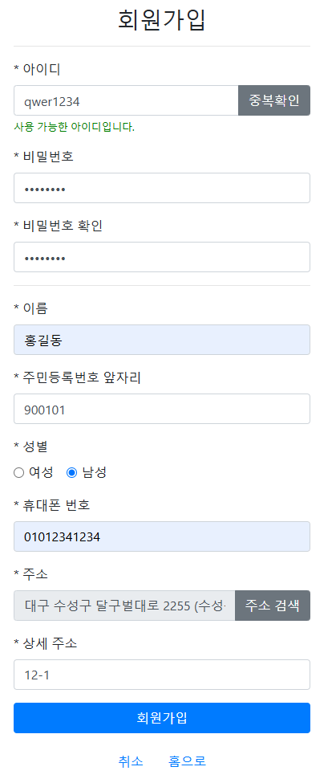

### - 프로젝트명
- 대구 의료 서비스 웹 사이트

### - 개발 환경
- Java, Spring Boot STS 4, MySQL DB, MySQL WorkBench 8.0 CE, HTML 5, JavaScript, Thymeleaf, D3.js 등

### - 주요 기능
- 회원 가입, 회원 탈퇴, 로그인, 회원 정보 수정, 아이디 비밀번호 찾기 기능
- Covid-19 문진표 등록, 조회, 수정, 삭제 기능 (회원 전용)
- 병원 예약 및 취소기능 (회원 전용)
- 지역, 진료과목별 병원 검색 및 전체 조회 기능
- 등록된 전체 Covid-19 환자의 성별, 연령대별 데이터 차트 조회 기능
- 등록된 대구 병원의 지역별, 진료과목별 차트 조회 기능
- 관리자 전용 기능
- 공지사항 게시판 기능 (관리자만 게시글 등록, 수정, 삭제 가능)

### - 구동 과정
#### 1. 웹 사이트 홈

```java

```

- 홈 화면의 상단에 주요 메뉴들이 있으며, 메뉴에 마우스를 올리면 하위 메뉴들이 열리고, 클릭하면 해당 세부 메뉴로 이동됩니다.


```java

```

- 
