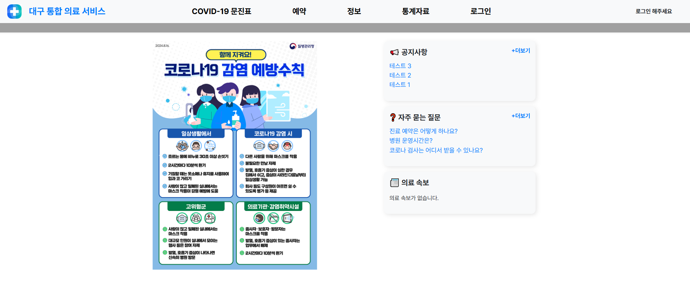
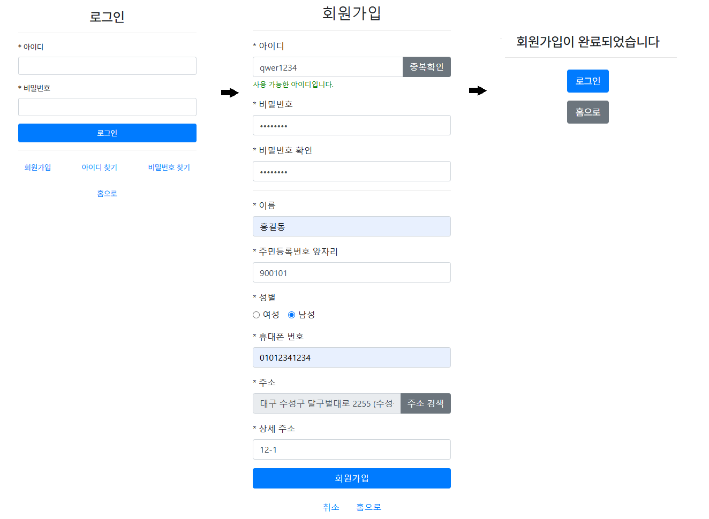

### - 프로젝트명
- 대구 의료 서비스 웹 사이트

### - 개발 환경
- Java, Spring Boot STS 4, MySQL DB, MySQL WorkBench 8.0 CE, HTML 5, JavaScript, Thymeleaf, D3.js 등

### - 주요 기능
- 회원 가입, 회원 탈퇴, 로그인, 회원 정보 수정, 아이디 비밀번호 찾기 기능
- Covid-19 문진표 등록, 조회, 수정, 삭제 기능 (회원 전용)
- 병원 예약 및 취소기능 (회원 전용)
- 지역, 진료과목별 병원 검색 및 전체 조회 기능
- 등록된 전체 Covid-19 환자의 성별, 연령대별 데이터 차트 조회 기능
- 등록된 대구 병원의 지역별, 진료과목별 차트 조회 기능
- 관리자 전용 기능
- 공지사항 게시판 기능 (관리자의 게시글 등록, 수정, 삭제 기능)

### - 구동 과정
#### 1. 웹 사이트 홈

```java
// build.gradle
plugins {
	id 'java'
	id 'org.springframework.boot' version '3.4.3'
	id 'io.spring.dependency-management' version '1.1.7'
}

group = 'Hospital'
version = '0.0.1-SNAPSHOT'

java {
	sourceCompatibility = JavaVersion.VERSION_17
    targetCompatibility = JavaVersion.VERSION_17
}
gradle.rootProject {
    ext {
        javaHome = "C:/Program Files/Java/jdk-17"
    }
}
configurations {
	compileOnly {
		extendsFrom annotationProcessor
	}
}

repositories {
	mavenCentral()
}

dependencies {
	implementation 'org.springframework.boot:spring-boot-starter-data-jpa'
	implementation 'org.springframework.boot:spring-boot-starter-thymeleaf'
	implementation 'org.springframework.boot:spring-boot-starter-web'
	implementation 'org.springframework.boot:spring-boot-starter-validation'
	implementation 'org.springframework.boot:spring-boot-starter-logging'  // 로깅
	developmentOnly 'org.springframework.boot:spring-boot-devtools'
	compileOnly 'org.projectlombok:lombok'
	runtimeOnly 'com.mysql:mysql-connector-j'
	runtimeOnly 'org.webjars:bootstrap:4.5.0'
	annotationProcessor 'org.projectlombok:lombok'
	testImplementation 'org.springframework.boot:spring-boot-starter-test'
	testImplementation 'org.junit.jupiter:junit-jupiter-api:5.8.2'
   	 testImplementation 'org.junit.jupiter:junit-jupiter-engine:5.8.2'
	testRuntimeOnly 'org.junit.platform:junit-platform-launcher'
	implementation 'com.fasterxml.jackson.datatype:jackson-datatype-jsr310:2.15.0'
	implementation 'org.json:json:20210307'
}
bootJar {
    mainClass = 'Hospital.HospitalApplication'
}
```

```java
// application.properties
spring.application.name=Hospital
spring.datasource.driver-class-name=com.mysql.cj.jdbc.Driver
spring.datasource.url=jdbc:mysql://localhost:3306/test_db
spring.datasource.username=admin
spring.datasource.password=0000
spring.jpa.show-sql=true
spring.jpa.hibernate.ddl-auto=update
spring.jpa.properties.hibernate.format_sql=true
spring.thymeleaf.cache=false

spring.jackson.serialization.FAIL_ON_EMPTY_BEANS=false
spring.cache.type=simple
logging.level.org.springframework.cache=DEBUG
```

```java
@GetMapping("/Home") // 홈 화면 이동
	public String GotoHome(HttpSession session, Model model) {
		String UserId = (String)session.getAttribute("UserId");
		if(UserId != null) {
			UserReadDTO uiDTO = this.userService.UserInfoRead(UserId);
			model.addAttribute("UserId",UserId);
			model.addAttribute("UserName",uiDTO.getUserName());
			session.setAttribute("UserId",UserId);
			session.setAttribute("UserName",uiDTO.getUserName());
		}
		else {
			model.addAttribute("UserId",null);
			model.addAttribute("UserName",null);
		}
		   //  의료 속보 데이터 추가
        List<SpotNewsResponseDTO> spotNewsList = sns.getAllNews();
        model.addAttribute("spotNewsList", spotNewsList);
        model.addAttribute("recentPosts", boardService.RecentBoardList());
        return "/Home";
	}
```

```html
<div th:fragment="navbar">
  <nav class="navbar navbar-expand-lg bg-light" style="font-weight: bold;">
    <a th:href="@{/Home}">
      
    </a>
    <a class="navbar-brand" th:href="@{/Home}" style="margin-left:20px; margin-right:150px; max-width:300px; ">
      <span style="font-size:25px;">대구 통합 의료 서비스　　　</span>
    </a>

    <div class="container text-center" style="margin-right:20%;">
      <ul class="navbar-nav ml-auto">
        <li class="nav-item dropdown">
          <a href="#" class="nav-link">COVID-19 문진표</a>
        <div class="dropdown-menu" th:if="${UserId == null}">
            <a href="#" onclick="CheckLogin()" class="dropdown-item">COVID-19 문진표작성</a>
            <a href="#" onclick="CheckLogin()" class="dropdown-item">COVID-19 문진표조회</a>
          </div>
          <div class="dropdown-menu" th:if="${UserId != null}">
            <a th:href="@{/PatientInfo/Input}" class="dropdown-item">COVID-19 문진표작성</a>
            <a th:href="@{/PatientInfo/List}" class="dropdown-item">COVID-19 문진표조회</a>
          </div>
        </li>
        <li class="nav-item dropdown">
          <a href="#" class="nav-link">예약</a>
          <div class="dropdown-menu" th:if="${UserId == null}">
            <a href="#" onclick="CheckLogin()" class="dropdown-item">병원예약</a>
            <a href="#" onclick="CheckLogin()" class="dropdown-item">예약조회</a>
          </div>
          <div class="dropdown-menu" th:if="${UserId != null}">
            <a th:href="@{/AppointmentPage/Input}" class="dropdown-item">병원예약</a>
            <a th:href="@{/AppointmentPage/List}" class="dropdown-item">예약조회</a>
          </div>
        </li>
        <li class="nav-item dropdown">
          <a href="#" class="nav-link">정보</a>
          <div class="dropdown-menu">
            
            <a th:href="@{/AllHospitalList}" class="dropdown-item">전체병원조회</a>
            <a th:href="@{/BoardPage/List}" class="dropdown-item">공지사항</a>
            <a th:href="@{/BoardPage/FAQ}" class="dropdown-item">자주묻는질문</a>
          </div>
        </li>
		<li class="nav-item dropdown">
			<a href="#" class="nav-link">통계자료</a>
			<div class="dropdown-menu">
				<a th:href="@{/Chart/ShowPatientRegion}" class="dropdown-item">COVID-19 감염자 분포</a>
					<a th:href="@{/Chart/ShowPatient}" class="dropdown-item">COVID-19 문진표 통계</a>
					<a th:href="@{/Chart/DetailPatient}" class="dropdown-item">COVID-19 문진표 세부 통계</a>
					<a th:href="@{/Chart/ShowHospitalRegion}" class="dropdown-item">대구 병원 지역별 통계</a>
			</div>
		</li>
        <li class="nav-item dropdown" th:if="${UserId == null}">
          <a th:href="@{/UserPage/Login}" class="nav-link">로그인</a>
          <div class="dropdown-menu">
            <a th:href="@{/UserPage/Login}" class="dropdown-item">로그인</a>
            <a th:href="@{/UserPage/SignUp}" class="dropdown-item">회원가입</a>
            <a th:href="@{/UserPage/FindUserId}" class="dropdown-item">아이디 찾기</a>
            <a th:href="@{/UserPage/FindUserPw}" class="dropdown-item">비밀번호 찾기</a>
          </div>
        </li>
        <li class="nav-item dropdown" th:if="${(UserId != null) and (UserId != 'admin')}">
          <a href="#" class="nav-link">회원메뉴</a>
       <div class="dropdown-menu">
              <a th:href="@{/UserPage/EditUserInfo}" class="dropdown-item">마이페이지</a>
              <a th:href="@{/UserPage/Logout}" class="dropdown-item">로그아웃</a>
       </div>
      </li>

        <li class="nav-item dropdown" th:if="${(UserId != null) and (UserId == 'admin')}">
          <a th:href="@{/AdminPage/Menu}" class="nav-link">관리자메뉴</a>
          <div class="dropdown-menu">
            <a th:if="${UserId == 'admin'}" th:href="@{/AdminPage/Menu}" class="dropdown-item">관리자메뉴</a>
            <a th:href="@{/UserPage/EditUserInfo}" class="dropdown-item">관리자정보</a>
            <a th:href="@{/UserPage/Logout}" class="dropdown-item">로그아웃</a>
          </div>
        </li>
        
      </ul>
    </div>
    <div th:if="${UserId == null}" style="width:300px;" th:text="|로그인 해주세요|">　</div>
    <div th:if="${UserId != null}" style="width:300px;margin-right:50px;margin-left:50px;" 
		th:text="'환영합니다,　' + ${UserName} + ' (' + ${UserId} + ') 님'"></div>
  </nav>
```

- 홈 화면의 상단에 주요 메뉴들이 있으며, 메뉴에 마우스를 올리면 하위 메뉴들이 열리고, 클릭하면 해당 세부 메뉴로 이동됩니다.



```java
// Entity
@Entity
@Data
@Builder
@NoArgsConstructor
@AllArgsConstructor
public class User {
	@Id
	@Column(length = 12, columnDefinition = "VARCHAR(12) COLLATE utf8mb4_bin")
	private String UserId;
	@Column(columnDefinition = "CHAR(64)")
	private String UserPw;
	@Column(columnDefinition = "VARCHAR(4)")
	private String UserName;
	@Column(columnDefinition = "CHAR(6)")
	private String UserRegNum;
	@Column(columnDefinition = "TINYINT")
	private Integer UserGender;
	@Column(columnDefinition = "CHAR(11) COLLATE ascii_bin")
	private String UserPhone;
	@Column(columnDefinition = "VARCHAR(50)")
	private String UserAddress1;
	@Column(columnDefinition = "VARCHAR(25)")
	private String UserAddress2;
	@Column(columnDefinition = "BINARY(16)", nullable = false)
	private byte[] User_Salt; 
	@CreationTimestamp
	private LocalDateTime InsertDateTime;
}
```

```java
// DTO
@Getter
@Setter
public class UserCreateDTO {
	@NonNull
	private String UserId;
	@NonNull
	private String UserPw;
	@NonNull
	private String UserName;
	@NonNull
	private String UserRegNum;
	@NonNull
	private Integer UserGender;
	@NonNull
	private String UserPhone;
	@NonNull
	private String UserAddress1;
	@NonNull
	private String UserAddress2;
	@NonNull
	private byte[] Salt;
}
```

```java
// Service
// 로그인 수행
public boolean UserLogin(String UserId, String UserPw) throws Exception{ 
		User userinfo = this.userRepository.findById(UserId).orElse(null);
		if(userinfo==null) {
			return false;
		}
		else if(!userinfo.getUserPw()
				.equals(PWSecurity.Hashing(UserPw.getBytes(), userinfo.getUser_Salt()))) {
			return false;
		}
		return true;
	}
// 회원가입 수행
    public void UserRegister(UserCreateDTO ucDTO) throws Exception {
        byte[] salt = PWSecurity.generateSalt(); 
        String hashedPassword = PWSecurity.Hashing(ucDTO.getUserPw().getBytes(), salt);
        User user = User.builder()
                .UserId(ucDTO.getUserId())
                .UserPw(hashedPassword)
                .UserName(ucDTO.getUserName())
                .UserRegNum(ucDTO.getUserRegNum())
                .UserGender(ucDTO.getUserGender())
                .UserPhone(ucDTO.getUserPhone())
                .UserAddress1(ucDTO.getUserAddress1())
                .UserAddress2(ucDTO.getUserAddress2())
                .User_Salt(salt) 
                .build();
        this.userRepository.save(user); 
    }
    
    //회원 가입시 아이디 중복 확인
  	public boolean UserIdCheck(String UserId) {
  		return this.userRepository.existsById(UserId);
  	}
```

```java
// Controller
@GetMapping("/UserPage/Login") // 로그인 화면으로 이동
	public String GotoLogin() {
		return "/UserPage/Login";
	}
	@PostMapping("/UserPage/Login") // 로그인 버튼 누르면 실행
	public String Login(@RequestParam("UserId") String UserId,
						@RequestParam("UserPw") String UserPw,
						HttpSession session, Model model) throws Exception  {
		boolean Result = this.userService.UserLogin(UserId,UserPw);
		if(Result == true){
			session.setAttribute("UserId", UserId);
			System.out.println(UserId);
			return "redirect:/Home";
		}
		else {
			model.addAttribute("Error", "아이디 또는 비밀번호가 틀렸습니다.");
			return "/UserPage/Login";
		}
	}
	
	@GetMapping("/UserPage/SignUp") // 회원가입 버튼을 누르면 회원가입 화면으로 이동 
	public String GotoSignUp() {
		return "/UserPage/SignUp";
	}
	
	@PostMapping("/UserPage/SignUp") // 회원가입 화면에서, 입력 후 회원가입 완료 누르면 실행 후 이동
	public String SignUp(UserCreateDTO ucDTO, RedirectAttributes rda) throws Exception {
		if(this.userService.UserIdCheck(ucDTO.getUserId())) {
			rda.addFlashAttribute("Error","사용할 수 없는 아이디입니다.");
			rda.addFlashAttribute("UserId",ucDTO.getUserId());
			rda.addFlashAttribute("UserName",ucDTO.getUserName());
			rda.addFlashAttribute("UserRegNum",ucDTO.getUserRegNum());
			rda.addFlashAttribute("UserPhone",ucDTO.getUserPhone());
			rda.addFlashAttribute("UserGender",ucDTO.getUserGender());
			rda.addFlashAttribute("UserAddress1",ucDTO.getUserAddress1());
			rda.addFlashAttribute("UserAddress2",ucDTO.getUserAddress2());
			return "redirect:/UserPage/SignUp";
		}
		this.userService.UserRegister(ucDTO);
		return "/UserPage/SignUpComplete";
	}
	
	
	@PostMapping("/UserPage/CheckUserId") 
	@ResponseBody// 아이디 중복체크
	public Map<String, String> CheckUserId(@RequestBody Map<String, String> requestData) {
	    String userId = requestData.get("userId");
	    Map<String, String> response = new HashMap<>();
	    if (this.userService.UserIdCheck(userId)) {
	        response.put("status", "error");
	        response.put("message", "아이디가 이미 존재합니다.");
	    } else {
	        response.put("status", "success");
	        response.put("message", "사용 가능한 아이디입니다.");
	    }	    
	    return response;
	}
	
	
	@GetMapping("/UserPage/Logout") // 로그아웃
	public String Logout(HttpSession session) {
		session.invalidate();
		return "redirect:/Home";
	}
```


- 주요 기능인 문진표 등록, 병원 예약을 이용하기위해선 회원 가입을 하여 로그인 하여야 합니다.
  
  
