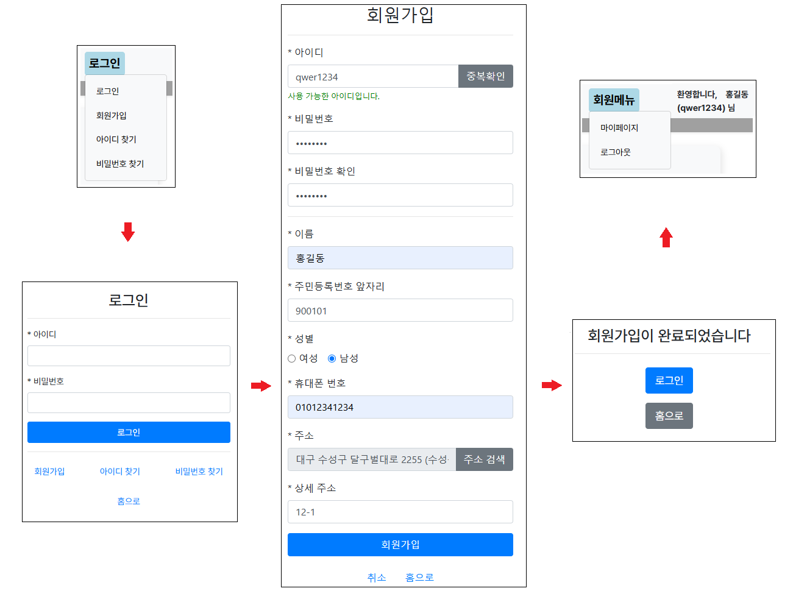
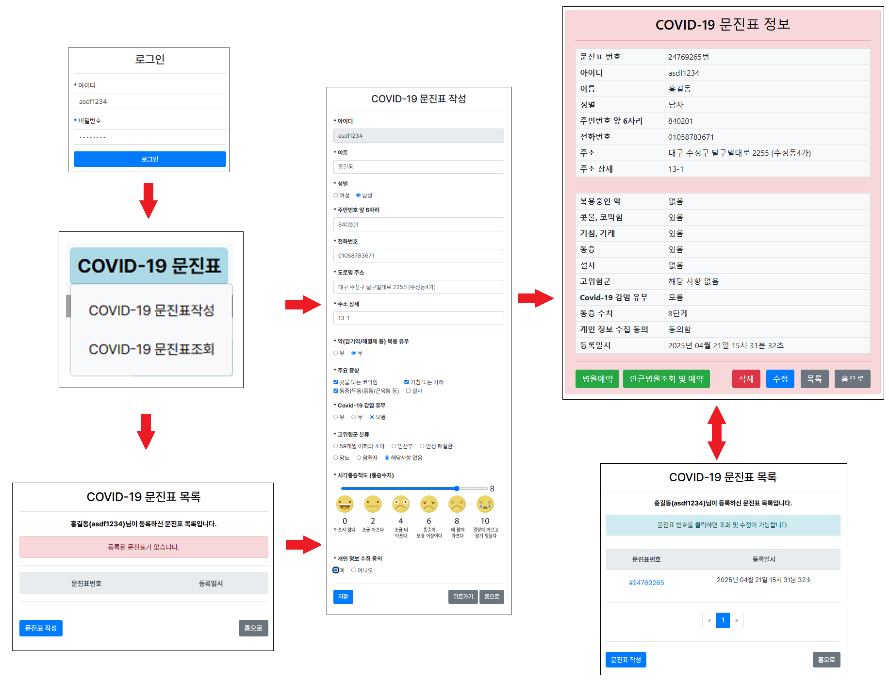
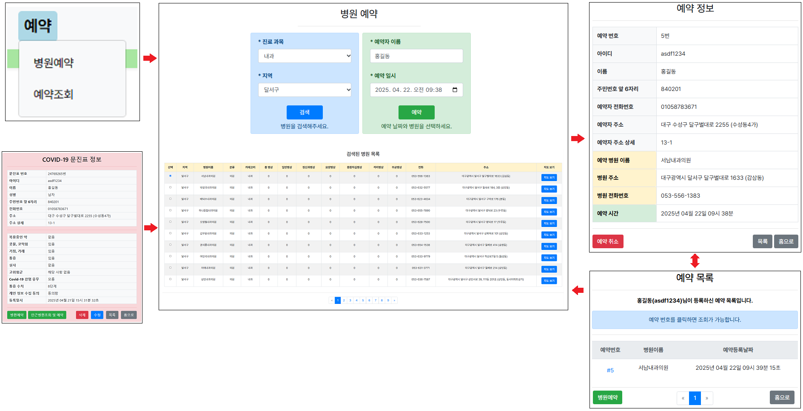
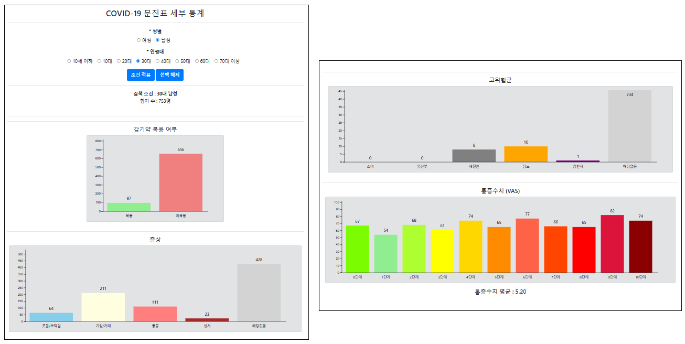

### - 프로젝트명
- 대구 의료 서비스 웹 사이트


### - 개발 환경
- Java, Spring Boot STS 4, MySQL DB, MySQL WorkBench 8.0 CE, HTML 5, JavaScript, Thymeleaf, D3.js 등


### - 주요 기능
- 회원 가입, 회원 탈퇴, 로그인, 회원 정보 수정, 아이디 비밀번호 찾기 기능
- Covid-19 문진표 등록, 조회, 수정, 삭제 기능 (회원 전용)
- 병원 예약 및 취소 기능 (회원 전용)
- 지역, 진료과목별 병원 검색 및 전체 조회 기능
- 등록된 전체 Covid-19 환자의 성별, 연령대별 데이터 통계 차트 조회 기능
- 공지사항 게시판 기능 (관리자의 게시글 등록, 수정, 삭제 기능)


### - 구동 과정

#### 1. 웹 사이트 홈


- 홈 화면의 상단에 주요 메뉴들이 있으며, 메뉴에 마우스를 올리면 하위 메뉴들이 열리고, 클릭하면 해당 세부 메뉴로 이동됩니다.

```java
// build.gradle
plugins {
	id 'java'
	id 'org.springframework.boot' version '3.4.3'
	id 'io.spring.dependency-management' version '1.1.7'
}

group = 'Hospital'
version = '0.0.1-SNAPSHOT'

java {
	sourceCompatibility = JavaVersion.VERSION_17
    targetCompatibility = JavaVersion.VERSION_17
}
gradle.rootProject {
    ext {
        javaHome = "C:/Program Files/Java/jdk-17"
    }
}
configurations {
	compileOnly {
		extendsFrom annotationProcessor
	}
}

repositories {
	mavenCentral()
}

dependencies {
	implementation 'org.springframework.boot:spring-boot-starter-data-jpa'
	implementation 'org.springframework.boot:spring-boot-starter-thymeleaf'
	implementation 'org.springframework.boot:spring-boot-starter-web'
	implementation 'org.springframework.boot:spring-boot-starter-validation'
	implementation 'org.springframework.boot:spring-boot-starter-logging'  // 로깅
	developmentOnly 'org.springframework.boot:spring-boot-devtools'
	compileOnly 'org.projectlombok:lombok'
	runtimeOnly 'com.mysql:mysql-connector-j'
	runtimeOnly 'org.webjars:bootstrap:4.5.0'
	annotationProcessor 'org.projectlombok:lombok'
	testImplementation 'org.springframework.boot:spring-boot-starter-test'
	testImplementation 'org.junit.jupiter:junit-jupiter-api:5.8.2'
   	 testImplementation 'org.junit.jupiter:junit-jupiter-engine:5.8.2'
	testRuntimeOnly 'org.junit.platform:junit-platform-launcher'
	implementation 'com.fasterxml.jackson.datatype:jackson-datatype-jsr310:2.15.0'
	implementation 'org.json:json:20210307'
}
bootJar {
    mainClass = 'Hospital.HospitalApplication'
}
```

```java
// application.properties
spring.application.name=Hospital
spring.datasource.driver-class-name=com.mysql.cj.jdbc.Driver
spring.datasource.url=jdbc:mysql://localhost:3306/test_db
spring.datasource.username=admin
spring.datasource.password=0000
spring.jpa.show-sql=true
spring.jpa.hibernate.ddl-auto=update
spring.jpa.properties.hibernate.format_sql=true
spring.thymeleaf.cache=false

spring.jackson.serialization.FAIL_ON_EMPTY_BEANS=false
spring.cache.type=simple
logging.level.org.springframework.cache=DEBUG
```

```java
@GetMapping("/Home") // 홈 화면 이동
	public String GotoHome(HttpSession session, Model model) {
		String UserId = (String)session.getAttribute("UserId");
		if(UserId != null) {
			UserReadDTO uiDTO = this.userService.UserInfoRead(UserId);
			model.addAttribute("UserId",UserId);
			model.addAttribute("UserName",uiDTO.getUserName());
			session.setAttribute("UserId",UserId);
			session.setAttribute("UserName",uiDTO.getUserName());
		}
		else {
			model.addAttribute("UserId",null);
			model.addAttribute("UserName",null);
		}
		   //  의료 속보 데이터 추가
        List<SpotNewsResponseDTO> spotNewsList = sns.getAllNews();
        model.addAttribute("spotNewsList", spotNewsList);
        model.addAttribute("recentPosts", boardService.RecentBoardList());
        return "/Home";
	}
```

```html
<div th:fragment="navbar">
  <nav class="navbar navbar-expand-lg bg-light" style="font-weight: bold;">
    <a th:href="@{/Home}">
      
    </a>
    <a class="navbar-brand" th:href="@{/Home}" style="margin-left:20px; margin-right:150px; max-width:300px; ">
      <span style="font-size:25px;">대구 통합 의료 서비스　　　</span>
    </a>

    <div class="container text-center" style="margin-right:20%;">
      <ul class="navbar-nav ml-auto">
        <li class="nav-item dropdown">
          <a href="#" class="nav-link">COVID-19 문진표</a>
        <div class="dropdown-menu" th:if="${UserId == null}">
            <a href="#" onclick="CheckLogin()" class="dropdown-item">COVID-19 문진표작성</a>
            <a href="#" onclick="CheckLogin()" class="dropdown-item">COVID-19 문진표조회</a>
          </div>
          <div class="dropdown-menu" th:if="${UserId != null}">
            <a th:href="@{/PatientInfo/Input}" class="dropdown-item">COVID-19 문진표작성</a>
            <a th:href="@{/PatientInfo/List}" class="dropdown-item">COVID-19 문진표조회</a>
          </div>
        </li>
        <li class="nav-item dropdown">
          <a href="#" class="nav-link">예약</a>
          <div class="dropdown-menu" th:if="${UserId == null}">
            <a href="#" onclick="CheckLogin()" class="dropdown-item">병원예약</a>
            <a href="#" onclick="CheckLogin()" class="dropdown-item">예약조회</a>
          </div>
          <div class="dropdown-menu" th:if="${UserId != null}">
            <a th:href="@{/AppointmentPage/Input}" class="dropdown-item">병원예약</a>
            <a th:href="@{/AppointmentPage/List}" class="dropdown-item">예약조회</a>
          </div>
        </li>
        <li class="nav-item dropdown">
          <a href="#" class="nav-link">정보</a>
          <div class="dropdown-menu">
            
            <a th:href="@{/AllHospitalList}" class="dropdown-item">전체병원조회</a>
            <a th:href="@{/BoardPage/List}" class="dropdown-item">공지사항</a>
            <a th:href="@{/BoardPage/FAQ}" class="dropdown-item">자주묻는질문</a>
          </div>
        </li>
		<li class="nav-item dropdown">
			<a href="#" class="nav-link">통계자료</a>
			<div class="dropdown-menu">
				<a th:href="@{/Chart/ShowPatientRegion}" class="dropdown-item">COVID-19 감염자 분포</a>
					<a th:href="@{/Chart/ShowPatient}" class="dropdown-item">COVID-19 문진표 통계</a>
					<a th:href="@{/Chart/DetailPatient}" class="dropdown-item">COVID-19 문진표 세부 통계</a>
					<a th:href="@{/Chart/ShowHospitalRegion}" class="dropdown-item">대구 병원 지역별 통계</a>
			</div>
		</li>
        <li class="nav-item dropdown" th:if="${UserId == null}">
          <a th:href="@{/UserPage/Login}" class="nav-link">로그인</a>
          <div class="dropdown-menu">
            <a th:href="@{/UserPage/Login}" class="dropdown-item">로그인</a>
            <a th:href="@{/UserPage/SignUp}" class="dropdown-item">회원가입</a>
            <a th:href="@{/UserPage/FindUserId}" class="dropdown-item">아이디 찾기</a>
            <a th:href="@{/UserPage/FindUserPw}" class="dropdown-item">비밀번호 찾기</a>
          </div>
        </li>
        <li class="nav-item dropdown" th:if="${(UserId != null) and (UserId != 'admin')}">
          <a href="#" class="nav-link">회원메뉴</a>
       <div class="dropdown-menu">
              <a th:href="@{/UserPage/EditUserInfo}" class="dropdown-item">마이페이지</a>
              <a th:href="@{/UserPage/Logout}" class="dropdown-item">로그아웃</a>
       </div>
      </li>

        <li class="nav-item dropdown" th:if="${(UserId != null) and (UserId == 'admin')}">
          <a th:href="@{/AdminPage/Menu}" class="nav-link">관리자메뉴</a>
          <div class="dropdown-menu">
            <a th:if="${UserId == 'admin'}" th:href="@{/AdminPage/Menu}" class="dropdown-item">관리자메뉴</a>
            <a th:href="@{/UserPage/EditUserInfo}" class="dropdown-item">관리자정보</a>
            <a th:href="@{/UserPage/Logout}" class="dropdown-item">로그아웃</a>
          </div>
        </li>
        
      </ul>
    </div>
    <div th:if="${UserId == null}" style="width:300px;" th:text="|로그인 해주세요|">　</div>
    <div th:if="${UserId != null}" style="width:300px;margin-right:50px;margin-left:50px;" 
		th:text="'환영합니다,　' + ${UserName} + ' (' + ${UserId} + ') 님'"></div>
  </nav>
```

---

#### 2. 회원가입 및 로그인



- 사이트의 일부 기능을 이용하기 위해선 로그인이 필요합니다.
- 상단 네비게이션바 혹은 로그인 화면에서 회원 가입 버튼을 눌러 회원 가입 진행이 가능합니다.

```java
@Entity
@Data
@Builder
@NoArgsConstructor
@AllArgsConstructor
public class User {
	@Id
	@Column(length = 12, columnDefinition = "VARCHAR(12) COLLATE utf8mb4_bin")
	private String UserId;
	@Column(columnDefinition = "CHAR(64)")
	private String UserPw;
	@Column(columnDefinition = "VARCHAR(4)")
	private String UserName;
	@Column(columnDefinition = "CHAR(6)")
	private String UserRegNum;
	@Column(columnDefinition = "TINYINT")
	private Integer UserGender;
	@Column(columnDefinition = "CHAR(11) COLLATE ascii_bin")
	private String UserPhone;
	@Column(columnDefinition = "VARCHAR(50)")
	private String UserAddress1;
	@Column(columnDefinition = "VARCHAR(25)")
	private String UserAddress2;
	@Column(columnDefinition = "BINARY(16)", nullable = false)
	private byte[] User_Salt; 
	@CreationTimestamp
	private LocalDateTime InsertDateTime;
}
```

```java
@Getter
@Setter
public class UserCreateDTO {
	@NonNull
	private String UserId;
	@NonNull
	private String UserPw;
	@NonNull
	private String UserName;
	@NonNull
	private String UserRegNum;
	@NonNull
	private Integer UserGender;
	@NonNull
	private String UserPhone;
	@NonNull
	private String UserAddress1;
	@NonNull
	private String UserAddress2;
	@NonNull
	private byte[] Salt;
}
```

```java
@Service
public class UserService {

	@Autowired
	private UserRepository userRepository;

	// 로그인 수행
	public boolean UserLogin(String UserId, String UserPw) throws Exception{ 
		User userinfo = this.userRepository.findById(UserId).orElse(null);
		if(userinfo==null) {
			return false;
		}
		else if(!userinfo.getUserPw()
				.equals(PWSecurity.Hashing(UserPw.getBytes(), userinfo.getUser_Salt()))) {
			return false;
		}
		return true;
	}

	// 회원가입 수행
    public void UserRegister(UserCreateDTO ucDTO) throws Exception {
        byte[] salt = PWSecurity.generateSalt(); 
        String hashedPassword = PWSecurity.Hashing(ucDTO.getUserPw().getBytes(), salt);
        User user = User.builder()
                .UserId(ucDTO.getUserId())
                .UserPw(hashedPassword)
                .UserName(ucDTO.getUserName())
                .UserRegNum(ucDTO.getUserRegNum())
                .UserGender(ucDTO.getUserGender())
                .UserPhone(ucDTO.getUserPhone())
                .UserAddress1(ucDTO.getUserAddress1())
                .UserAddress2(ucDTO.getUserAddress2())
                .User_Salt(salt) 
                .build();
        this.userRepository.save(user); 
    }
    
    //회원 가입시 아이디 중복 확인
  	public boolean UserIdCheck(String UserId) {
  		return this.userRepository.existsById(UserId);
  	}
}
```

```java
@Controller
public class UserController {

	@Autowired
	private UserService userService;

	@GetMapping("/UserPage/Login") // 로그인 화면으로 이동
		public String GotoLogin() {
			return "/UserPage/Login";
		}

	@PostMapping("/UserPage/Login") // 로그인 버튼 누르면 실행
	public String Login(@RequestParam("UserId") String UserId,
						@RequestParam("UserPw") String UserPw,
						HttpSession session, Model model) throws Exception  {
		boolean Result = this.userService.UserLogin(UserId,UserPw);
		if(Result == true){
			session.setAttribute("UserId", UserId);
			System.out.println(UserId);
			return "redirect:/Home";
		}
		else {
			model.addAttribute("Error", "아이디 또는 비밀번호가 틀렸습니다.");
			return "/UserPage/Login";
		}
	}
	
	@GetMapping("/UserPage/SignUp") // 회원가입 버튼을 누르면 회원가입 화면으로 이동 
	public String GotoSignUp() {
		return "/UserPage/SignUp";
	}
	
	@PostMapping("/UserPage/SignUp") // 회원가입 화면에서, 입력 후 회원가입 완료 누르면 실행 후 이동
	public String SignUp(UserCreateDTO ucDTO, RedirectAttributes rda) throws Exception {
		if(this.userService.UserIdCheck(ucDTO.getUserId())) {
			rda.addFlashAttribute("Error","사용할 수 없는 아이디입니다.");
			rda.addFlashAttribute("UserId",ucDTO.getUserId());
			rda.addFlashAttribute("UserName",ucDTO.getUserName());
			rda.addFlashAttribute("UserRegNum",ucDTO.getUserRegNum());
			rda.addFlashAttribute("UserPhone",ucDTO.getUserPhone());
			rda.addFlashAttribute("UserGender",ucDTO.getUserGender());
			rda.addFlashAttribute("UserAddress1",ucDTO.getUserAddress1());
			rda.addFlashAttribute("UserAddress2",ucDTO.getUserAddress2());
			return "redirect:/UserPage/SignUp";
		}
		this.userService.UserRegister(ucDTO);
		return "/UserPage/SignUpComplete";
	}
	
	
	@PostMapping("/UserPage/CheckUserId") 
	@ResponseBody// 아이디 중복체크
	public Map<String, String> CheckUserId(@RequestBody Map<String, String> requestData) {
	    String userId = requestData.get("userId");
	    Map<String, String> response = new HashMap<>();
	    if (this.userService.UserIdCheck(userId)) {
	        response.put("status", "error");
	        response.put("message", "아이디가 이미 존재합니다.");
	    } else {
	        response.put("status", "success");
	        response.put("message", "사용 가능한 아이디입니다.");
	    }	    
	    return response;
	}
	
	
	@GetMapping("/UserPage/Logout") // 로그아웃
	public String Logout(HttpSession session) {
		session.invalidate();
		return "redirect:/Home";
	}
}
```

```html
<!DOCTYPE html>
<html xmlns:th="http://www.thymeleaf.org">
<head>
  <meta charset="UTF-8">
  <title>회원가입</title>
  <link rel="stylesheet" href="/webjars/bootstrap/4.5.0/css/bootstrap.min.css" />
  <script>
    function CheckUserId() {
        var userId = document.getElementById('UserId').value;

        // 아이디 형식 검사
        var idPattern = /^(?=[a-zA-Z0-9]{4,12}$)(?![0-9]{4,12}$)[a-zA-Z0-9]+$/;
        if (!idPattern.test(userId)) {
            document.getElementById('IdError').style.color = "red";
            document.getElementById('IdError').textContent = "사용할 수 없는 아이디입니다.";
            return; // 형식이 잘못되면 중복 확인을 진행하지 않음
        }

        // Ajax 요청
        fetch('/UserPage/CheckUserId', {
            method: 'POST',
            headers: {
                'Content-Type': 'application/json',
            },
            body: JSON.stringify({ userId: userId })
        })
        .then(response => response.json())
        .then(data => {
            var errorElement = document.getElementById('IdError');
            if (data.status === 'error') {
                errorElement.style.color = "red";
                errorElement.textContent = "아이디가 이미 존재합니다.";
            } else {
                errorElement.style.color = "green";
                errorElement.textContent = "사용 가능한 아이디입니다.";
            }
        })
        .catch(error => {
            console.error('Error:', error);
            document.getElementById('IdError').textContent = "서버 오류가 발생했습니다.";
        });
    }

    function CheckForm(event) {
        var id = document.getElementsByName("UserId")[0].value;
        var pw = document.getElementsByName("UserPw")[0].value;
        var pwc = document.getElementsByName("UserPwc")[0].value; 
        var name = document.getElementsByName("UserName")[0].value;
        var regnum = document.getElementsByName("UserRegNum")[0].value;
        var phone = document.getElementsByName("UserPhone")[0].value;

        var idPattern = /^(?=[a-zA-Z0-9]{4,12}$)(?![0-9]{4,12}$)[a-zA-Z0-9]+$/;
        var pwPattern = /^(?=.*[A-Za-z])(?=.*\d)[A-Za-z\d@$!%*?&]{8,20}$/;
        var namePattern = /^[가-힣]{2,4}$/; //2-4자리 이름 허용
        var phonePattern = /^\d{11}$/; // 11자리 숫자만 허용
        var regnumPattern = /^\d{6}$/; // 6자리 숫자만 허용

       
        if (!idPattern.test(id)) { // 아이디 검증
            alert("아이디는 4~12자 사이의 영어와 숫자 조합만 가능합니다. 숫자만 포함된 아이디는 사용할 수 없습니다.");
            event.preventDefault();
            return false;
        }     
        if (!pwPattern.test(pw)) {
            alert("비밀번호는 8~20자리이며, 영문자/숫자를 포함해야 합니다.");// 비밀번호 검증
            event.preventDefault();
            return false;
        }      
        if (pw !== pwc) {
            alert("비밀번호가 일치하지 않습니다. 다시 입력해주세요.");// 비밀번호 확인
            event.preventDefault();
            return false;
        }
        if (!namePattern.test(name)) {
            alert("이름은 2~4글자 사이의 한글만 입력 가능합니다.");// 이름 검증
            event.preventDefault();
            return false;
        }
        if (!regnumPattern.test(regnum)) {
            alert("주민번호는 앞 6자리 숫자만 입력해주세요.");// 주민번호 검증
            event.preventDefault();
            return false;
        }
        if (!phonePattern.test(phone)) {
            alert("전화 번호는 숫자 11자리로만 입력해주세요.\n예) 01012341234");// 전화번호 검증
            event.preventDefault();
            return false;
        }
        return true;
    }
  </script>
</head>
<body>
<div th:replace="fragments/navbar :: navbar"></div>
<header th:insert="/UserPage/Header.html"></header>
  <div class="container mt-5" style="max-width: 400px;">
    <h3 class="text-center">회원가입</h3>
    <hr>

    <form method="POST" id="SignUpForm" onsubmit="return CheckForm(event)">
      <div class="form-group">
        <label for="UserId">* 아이디</label>
        <div class="input-group">
          <input type="text" name="UserId" id="UserId" class="form-control" placeholder="4~12자리 영어/숫자" required/>
          <div class="input-group-append">
            <button type="button" class="btn btn-secondary" id="CheckIdButton" onclick="CheckUserId()">중복확인</button>
          </div>
        </div>
        <small id="IdError" class="form-text"></small>
      </div>

      <div class="form-group">
        <label for="UserPw">* 비밀번호</label>
        <input type="password" name="UserPw" class="form-control" placeholder="8~20자리 영어+숫자" required/>
      </div>

      <div class="form-group">
        <label for="UserPwc">* 비밀번호 확인</label>
        <input type="password" name="UserPwc" class="form-control" placeholder="비밀번호 다시 입력" required/>
      </div>
	<hr>
      <div class="form-group">
        <label for="UserName">* 이름</label>
        <input type="text" name="UserName" class="form-control" placeholder="예) 홍길동" required/>
      </div>

      <div class="form-group">
        <label for="UserRegNum">* 주민등록번호 앞자리</label>
        <input type="text" name="UserRegNum" class="form-control" placeholder="예) 921014" required/>
      </div>

      <div class="form-group">
        <label>* 성별</label><br>
        <div class="form-check form-check-inline">
          <input type="radio" name="UserGender" value="1" class="form-check-input" required/>
          <label class="form-check-label">여성</label>
        </div>
        <div class="form-check form-check-inline">
          <input type="radio" name="UserGender" value="0" class="form-check-input"/>
          <label class="form-check-label">남성</label>
        </div>
      </div>

      <div class="form-group">
        <label for="UserPhone">* 휴대폰 번호</label>
        <input type="text" name="UserPhone" class="form-control" placeholder="예) 01012341234" required/>
      </div>

	  <div class="form-group">
	      <label for="UserAddress1">* 주소</label>
	      <div class="input-group">
	          <input type="text" name="UserAddress1" id="UserAddress1" class="form-control" placeholder="주소 검색 버튼을 눌러주세요" required readonly/>
	          <div class="input-group-append">
	              <button type="button" class="btn btn-secondary" onclick="execDaumPostcode()">주소 검색</button>
	          </div>
	      </div>
	  </div>

      <div class="form-group">
        <label for="UserAddress2">* 상세 주소</label>
        <input type="text" name="UserAddress2" class="form-control" placeholder="예) xx빌라 101호" required/>
      </div>

      <button type="submit" class="btn btn-primary btn-block">회원가입</button>
    </form>

    <div th:if="${Error}" class="mt-3 text-danger">
      <p th:text="${Error}"></p>
    </div>

    <div class="mt-3 text-center">
      <a class="btn btn-link" th:href="@{/UserPage/Login}" role="button">취소</a>
      <a class="btn btn-link" th:href="@{/Home}" role="button">홈으로</a>
    </div>
  </div>
  <br><br><br>
  <script src="https://t1.daumcdn.net/mapjsapi/bundle/postcode/prod/postcode.v2.js"></script> // 주소 검색 API
  <script>
      function execDaumPostcode() {
          new daum.Postcode({
              oncomplete: function(data) {
                  var fullAddr = ''; 
                  var extraAddr = '';

                  if (data.userSelectedType === 'R') {
                      fullAddr = data.roadAddress;
                  } else {
                      fullAddr = data.jibunAddress;
                  }

                  if (data.bname !== '' && /[동|로|가]$/g.test(data.bname)) {
                      extraAddr += data.bname;
                  }

                  if (data.buildingName !== '' && data.apartment === 'Y') {
                      extraAddr += (extraAddr !== '' ? ', ' + data.buildingName : data.buildingName);
                  }

                  if (extraAddr !== '') {
                      fullAddr += ' (' + extraAddr + ')';
                  }

                  document.getElementById('UserAddress1').value = fullAddr;
              }
          }).open();
      }
  </script>

  <script src="/webjars/jquery/3.5.1/jquery.min.js"></script>
  <script src="/webjars/bootstrap/4.5.0/js/bootstrap.min.js"></script>
</body>
</html>

```

---

#### 3. 아이디 찾기 및 비밀번호 찾기


- 아이디 혹은 비밀번호를 잊어버린경우 이름, 주민번호 앞 6자리 등을 입력 하여 찾을 수 있습니다.
- 비밀번호를 잊어버린경우는 재설정하여야 합니다.

```java
@Getter
@Setter
public class UserReadDTO {
	
	@Id
	private String UserId;
	
	private String UserPw;
	
	private String UserName;
	
	private String UserRegNum;
	
	private Integer UserGender;
	
	private String UserPhone;
	
	private String UserAddress1;
	
	private String UserAddress2;
	
	private LocalDateTime InsertDateTime;
	
	private byte[] User_Salt;
	
	public UserReadDTO FromUserInfo(User u) {
		this.UserId = u.getUserId();
		this.UserPw = u.getUserPw();
		this.UserName = u.getUserName();
		this.UserRegNum = u.getUserRegNum();
		this.UserGender = u.getUserGender();
		this.UserPhone = u.getUserPhone();
		this.UserAddress1 = u.getUserAddress1();
		this.UserAddress2 = u.getUserAddress2();
		this.InsertDateTime = u.getInsertDateTime();
		this.User_Salt = u.getUser_Salt();
		return this;
	}
	
	public static UserReadDTO UserInfoFactory(User u) {
		UserReadDTO uiDTO = new UserReadDTO();
		uiDTO.FromUserInfo(u);
		return uiDTO;
	}
}
```


```java
@Service
public class UserService {
	
	@Autowired
	private UserRepository userRepository;

	//회원정보 읽기
  	public UserReadDTO UserInfoRead(String UserId) { 
  		User userinfo = this.userRepository.findById(UserId).orElseThrow();
  		return UserReadDTO.UserInfoFactory(userinfo);
  	}

	//아이디 찾기
	public UserReadDTO FindUserId(String UserName, String UserRegNum) {
		List<User> userinfolist = new ArrayList<User>();
		User userinforesult;
		userinfolist = this.userRepository.findAll();
		for(User user: userinfolist) {
			if((user.getUserName().equals(UserName))&&(user.getUserRegNum().equals(UserRegNum))) {
				userinforesult = user;
				return UserReadDTO.UserInfoFactory(userinforesult);
			}
		}	
		return  null;
	}
	
	//비번 찾기
	public UserReadDTO FindUserPw(String UserId, String UserName, String UserRegNum) {
		
		User user = this.userRepository.findById(UserId).orElse(null);
		UserReadDTO urDTO = new UserReadDTO();
		if(user != null) {
			if((user.getUserName().equals(UserName)) && (user.getUserRegNum().equals(UserRegNum))) {
				return UserReadDTO.UserInfoFactory(user);
			}
			return urDTO = null;
		}
		else {	
			return urDTO = null;
		}
	}

	//비밀번호 재설정
	public void ResetUserPw(String UserId, String UserPw) throws Exception {
		User user = this.userRepository.findById(UserId).orElseThrow();
		user.setUserPw(PWSecurity.Hashing(UserPw.getBytes(), user.getUser_Salt()));
		this.userRepository.save(user);
	}
}
```


```java
@Controller
public class UserController {

	@Autowired
	private UserService userService;

	@GetMapping("/UserPage/FindUserId") // 로그인 페이지에서 아이디 찾기 누르면 이동
	public String GotoFindUserId() {
		return "/UserPage/FindUserId";
	}
	
	@PostMapping("/UserPage/FindUserId") // 아이디 찾기 페이지에서 정보 입력 후 찾기 버튼 누르면 수행
	public ModelAndView FindUserId(@RequestParam("UserName") String UserName,
				       @RequestParam("UserRegNum") String UserRegNum,
								     Model model) {
		ModelAndView mav = new ModelAndView();
		UserReadDTO uiDTO = new UserReadDTO();
		uiDTO = this.userService.FindUserId(UserName, UserRegNum);
		if(uiDTO != null) {
			mav.addObject("FindUserInfoResult", uiDTO);
			mav.setViewName("/UserPage/FindUserIdResult");
			return mav;
		}
		else {
			model.addAttribute("error","입력하신 정보와 일치하는 회원정보가 없습니다.");
			mav.setViewName("/UserPage/FindUserId");
			return mav;
		}
	}
	
	@GetMapping("/UserPage/FindUserIdResult") // 아이디 찾기 성공시 결과 페이지 이동
	public String GotoFindUserIdResult() {
		return "/UserPage/FindUserIdResult";
	}
	
	@GetMapping("/UserPage/FindUserPw") // 로그인 페이지에서 비밀번호 찾기 누르면 이동
	public String GotoFindUserPw() {
		return "/UserPage/FindUserPw";
	}
	
	@PostMapping("/UserPage/FindUserPw") // 비밀번호 찾기 페이지에서 정보 입력 후 버튼 누르면 수행
	public ModelAndView FindUserPw(@RequestParam("UserId") String UserId,
				       @RequestParam("UserName") String UserName,
				       @RequestParam("UserRegNum") String UserRegNum,
								     Model model) {
		ModelAndView mav = new ModelAndView();
		UserReadDTO uiDTO = new UserReadDTO();
		uiDTO = this.userService.FindUserPw(UserId, UserName, UserRegNum);
		if(uiDTO != null) {
			mav.addObject("FindUserInfoResult",uiDTO);
			mav.setViewName("/UserPage/ResetUserPw");
			return mav;
		}
		else {
			model.addAttribute("error","입력하신 정보와 일치하는 회원정보가 없습니다.");
			mav.setViewName("/UserPage/FindUserPw");
			return mav;
		}
	}

	@PostMapping("/UserPage/ResetUserPw") // 비밀번호 재설정 버튼 누르면 수행
	public String ResetUserPw(@RequestParam("UserId") String UserId,
				  @RequestParam("UserPw") String UserPw) throws Exception {
		
		this.userService.ResetUserPw(UserId, UserPw);
		return "/UserPage/ResetUserPwResult";
	}
}
```

```html
<!DOCTYPE html>
<html xmlns:th="http://www.thymeleaf.org">
<head>
  <meta charset="UTF-8">
  <title>비밀번호 찾기 - 회원 정보 조회 결과</title>
  <link rel="stylesheet" href="https://stackpath.bootstrapcdn.com/bootstrap/4.5.2/css/bootstrap.min.css" />
  <link rel="stylesheet" href="https://cdn.jsdelivr.net/gh/orioncactus/pretendard/dist/web/static/pretendard.css">
   <style>
  body {
  	    font-family: 'Pretendard', sans-serif;
  	}
   </style>
  <script>
    function CheckForm(event) {
      var pw = document.getElementsByName("UserPw")[0].value;
      var pwc = document.getElementsByName("UserPwc")[0].value;
      var pwPattern = /^(?=.*[A-Za-z])(?=.*\d)[A-Za-z\d@$!%*?&]{8,20}$/;

      if (pw !== pwc) {
        alert("비밀번호가 일치하지 않습니다. 다시 입력해주세요.");
        event.preventDefault();
        return false;
      }

      if (!pwPattern.test(pw)) {
        alert("비밀번호는 8~20자리이며, 영문자와 숫자를 포함해야 합니다.");
        event.preventDefault();
        return false;
      }
      return true;
    }
  </script>
</head>
<body>
<div th:replace="fragments/navbar :: navbar"></div>
<header th:insert="/UserPage/Header.html"></header>
  <div class="container mt-5" style="max-width: 450px;">
    <h3 class="mb-4">비밀번호 찾기 - 회원 정보 조회 결과</h3>

    <div th:if="${FindUserInfoResult.UserId != null}" class="alert alert-success">
      <b>입력하신 정보와 일치하는 회원정보를 찾았습니다.</b><br><br>
      <p><strong>아이디 :</strong> <span th:text="${FindUserInfoResult.UserId}" class="text-primary"></span></p>
      <p><strong>이름 :</strong> <span th:text="${FindUserInfoResult.UserName}"></span></p>
      <p><strong>주민번호 앞 6자리 :</strong> <span th:text="${FindUserInfoResult.UserRegNum}"></span></p>
      <p><strong>전화번호 :</strong> <span th:text="${FindUserInfoResult.UserPhone}"></span></p>
      <p><strong>주소 :</strong> <span th:text="${FindUserInfoResult.UserAddress1}"></span></p>
      <p><strong>주소 상세 :</strong> <span th:text="${FindUserInfoResult.UserAddress2}"></span></p>
    </div>

    <div th:if="${FindUserInfoResult.UserId == null}" class="alert alert-danger">
      <p>입력하신 정보와 일치하는 회원 정보가 없습니다.</p>
    </div>

    <div th:if="${FindUserInfoResult.UserId != null}">
      <hr>
      <h5>새 비밀번호 설정</h5>
      <form th:action="@{/UserPage/ResetUserPw}" method="POST" onsubmit="return CheckForm(event)">
        <input type="hidden" name="UserId" th:value="${FindUserInfoResult.UserId}">

        <div class="form-group">
          <label>* 아이디</label>
          <input type="text" class="form-control" th:value="${FindUserInfoResult.UserId}" disabled />
        </div>
        <div class="form-group">
          <label>* 비밀번호</label>
          <input type="password" name="UserPw" class="form-control" placeholder="8~20자리 영어+숫자" required />
        </div>
        <div class="form-group">
          <label>* 비밀번호 확인</label>
          <input type="password" name="UserPwc" class="form-control" placeholder="비밀번호 다시 입력" required />
        </div>
        <hr>
        <div class="mt-3">
        <button type="submit" class="btn btn-primary">비밀번호 재설정</button>
        
        <a href="#" th:href="@{/Home}" class="btn btn-secondary" style="float:right;margin-left:5px;">홈으로</a>
      	<a href="#" th:href="@{/UserPage/Login}" class="btn btn-secondary" style="float:right;">로그인</a>
    	</div>
      </form>
    </div>
  </div>
  <script src="https://code.jquery.com/jquery-3.5.1.min.js"></script>
  <script src="https://stackpath.bootstrapcdn.com/bootstrap/4.5.2/js/bootstrap.min.js"></script>
</body>
</html>
```


---

#### 4. 회원 정보 수정 및 회원 탈퇴


- 상단 네비게이션바의 마이페이지를 누르면 아이디를 제외한 각종 회원 정보를 수정할 수 있습니다.
- 회원 정보 수정 화면 하단의 회원 탈퇴 버튼을 누르면 비밀 번호 확인 후 회원 탈퇴가 가능합니다.
- 회원 탈퇴시 회원이 등록한 문진표 정보와 예약 정보가 모두 삭제된 후 계정이 삭제됩니다.

```java
@Getter
@Setter
public class UserEditDTO {
	
	@NonNull
	private String UserId;
	@NonNull
	private String UserPw;
	@NonNull
	private String UserName;
	@NonNull
	private String UserRegNum;
	@NonNull
	private Integer UserGender;
	@NonNull
	private String UserPhone;
	@NonNull
	private String UserAddress1;
	@NonNull
	private String UserAddress2;

	 
    public User Fill(User u) throws Exception {
        u.setUserPw(PWSecurity.Hashing(UserPw.getBytes(), u.getUser_Salt()));
        u.setUserName(this.UserName);
        u.setUserRegNum(this.UserRegNum);
        u.setUserGender(this.UserGender);
        u.setUserPhone(this.UserPhone);
        u.setUserAddress1(this.UserAddress1);
        u.setUserAddress2(this.UserAddress2);
        return u;
    }
}
```

```java
@Service
public class UserService {
	
	@Autowired
	private UserRepository userRepository;
	
	@Autowired
	private PatientService ps;
	
	@Autowired
	private PatientRepository pr;

	@Autowired
	private AppointmentService aps;
	
	public List<User> findAll(){
		return this.userRepository.findAll();
	}

	//회원정보 수정 기능
	public void UserModify(UserEditDTO uieDTO) throws Exception {
	    User user = this.userRepository.findById(uieDTO.getUserId()).orElseThrow();
	    String inputPwHashed = PWSecurity.Hashing(uieDTO.getUserPw().getBytes(), user.getUser_Salt());
	    if (!inputPwHashed.equals(user.getUserPw())) {
	        throw new IllegalArgumentException("비밀번호가 일치하지 않습니다.");
	    }
	    // 정보 반영 및 저장
	    user = uieDTO.Fill(user);// 이름, 전화번호, 주소 등 업데이트
	    this.userRepository.save(user);
	}

	// 회원 탈퇴 기능
	public boolean DeleteUserId(String UserId, String UserPw) throws Exception {
		User userinfo = this.userRepository.findById(UserId).orElseThrow();
		List<Patient> allpatient = new ArrayList<Patient>();
		allpatient = this.ps.findAll();

		if((userinfo.getUserPw().equals(PWSecurity.Hashing(UserPw.getBytes(), userinfo.getUser_Salt())))) {
			for(Patient patients: allpatient) {
				if(UserId!=null && patients.getP_UserId().equals(UserId)){
					Integer p_id = patients.getP_Id();
					this.pr.deleteById(p_id); // 문진표 삭제
				}
			}
			this.aps.AppointmentDeleteAllByUserId(UserId); // 예약 삭제
			this.userRepository.delete(userinfo); 
			return true;
		}
		return false;
	}
}
```

```java
@Controller
public class UserController {

	@Autowired
	private UserService userService;

	@GetMapping("/UserPage/EditUserInfo") // 회원정보 수정 화면으로 이동
	public ModelAndView GotoEditUserInfo(HttpSession session, Model model) {
		ModelAndView mav = new ModelAndView();
		String UserId = (String)session.getAttribute("UserId");
		
		if(UserId == null) {
			mav.setViewName("redirect:/Home");
			return mav;
		}
		
		model.addAttribute("UserId",UserId);
		UserReadDTO uiDTO = this.userService.UserInfoRead(UserId);
		mav.addObject("UserInfo",uiDTO);
		mav.setViewName("/UserPage/EditUserInfo");
		return mav;
	}
	
	@PostMapping("/UserPage/EditUserInfo") // 회원 정보 수정 화면에서 정보 입력 후 수정 버튼 누르면 수행
	public String EditUserInfo(UserEditDTO uieDTO, RedirectAttributes rda) throws Exception {
	    try {
	        this.userService.UserModify(uieDTO);
	        return "/UserPage/EditUserInfoResult";
	    } catch (IllegalArgumentException e) { 
	        rda.addFlashAttribute("error", e.getMessage()); // 에러 메시지
	        rda.addFlashAttribute("UserInfo", uieDTO); // 입력값 유지
	        return "redirect:/UserPage/EditUserInfo";
	    }
	}

	@GetMapping("/UserPage/DeleteUserId") // 회원 탈퇴 페이지 이동
	   public String GotoDeleteUserId(HttpSession session, Model model) {
	      String UserId = (String) session.getAttribute("UserId");
	      model.addAttribute("UserId",UserId);
	      
	      if(UserId.equals("admin")) { // 관리자는 회원 탈퇴 불가능하게 컨트롤러에서 우회
	         return "/Home";
	      }
	      else {
	         return "/UserPage/DeleteUserId";
	      }
	}
	
	
	@PostMapping("/UserPage/DeleteUserId") // 회원 탈퇴 진행
	public String DeleteUserId(@RequestParam("UserId") String UserId,
							   @RequestParam("UserPw") String UserPw,
							   HttpSession session, Model model) throws Exception {
		boolean result = this.userService.DeleteUserId(UserId, UserPw);
		if(result == true) {
			session.invalidate();
			return "/UserPage/DeleteUserIdResult";
		}
		else {
			model.addAttribute("UserId",UserId);
			model.addAttribute("Error","비밀번호가 일치하지 않습니다.");
			return "/UserPage/DeleteUserId";
		}
	}
	
	@GetMapping("/UserPage/DeleteUserIdResult") // 회원 탈퇴 결과
	public String GotoDeleteUserIdResult() {
		return "/UserPage/DeleteUserIdResult";
	}
}
```

```html
<div th:replace="fragments/navbar :: navbar"></div>
<header th:insert="/UserPage/Header.html"></header>
  <div class="container mt-5" style="max-width: 400px;">
    <h3>회원 정보 수정</h3>
    <hr>
    <form method="POST" th:object="${UserInfo}" id="UserInfoModifyForm" onsubmit="return CheckForm(event)">
      
      <input type="hidden" name="UserId" th:value="*{UserId}" />
      
      <div class="form-group">
        <label for="UserPw">* 비밀번호</label>
        <input type="password" name="UserPw" id="UserPw" class="form-control" placeholder="8~20자리 영어+숫자" required />
		
      </div>
      
      <div class="form-group">
        <label for="UserPwc">* 비밀번호 확인</label>
        <input type="password" name="UserPwc" id="UserPwc" class="form-control" placeholder="비밀번호 다시 입력" required />
		
		<div th:if="${error}" class="text-danger mt-1" th:text="${error}"></div>
      </div>
<hr>
      <div class="form-group">
        <label for="UserName">* 이름</label>
        <input type="text" name="UserName" id="UserName" th:value="*{UserName}" class="form-control" placeholder="예) 홍길동" required />
      </div>

      <div class="form-group">
        <label for="UserRegNum">* 주민등록번호 앞 6자리</label>
        <input type="text" name="UserRegNum" id="UserRegNum" th:value="*{UserRegNum}" class="form-control" placeholder="예) 921014" required />
      </div>

	  <div class="form-group">
	      <label>* 성별</label><br>
	      <div class="form-check form-check-inline">
	        <input type="radio" name="UserGender" value="1" class="form-check-input" required/>
	        <label class="form-check-label">여성</label>
	      </div>
	      <div class="form-check form-check-inline">
	        <input type="radio" name="UserGender" value="0" class="form-check-input"/>
	        <label class="form-check-label">남성</label>
	      </div>
	    </div>


      <div class="form-group">
        <label for="UserPhone">* 휴대폰 번호</label>
        <input type="text" name="UserPhone" id="UserPhone" th:value="*{UserPhone}" class="form-control" placeholder="예) 01012341234" required />
      </div>

	  <div class="form-group">
	        <label for="UserAddress1">* 주소</label>
	        <div class="input-group">
	            <input type="text" name="UserAddress1" id="UserAddress1" class="form-control" placeholder="주소 검색 버튼을 눌러주세요" required readonly/>
	            <div class="input-group-append">
	                <button type="button" class="btn btn-secondary" onclick="execDaumPostcode()">주소 검색</button>
	            </div>
	        </div>
	    </div>
	  

      <div class="form-group">
        <label for="UserAddress2">* 상세 주소</label>
        <input style="width:100%" type="text" name="UserAddress2" id="UserAddress2" th:value="*{UserAddress2}" class="form-control" placeholder="예) xx빌라 101호" required />
      </div>
      <hr>
	<div class="mt-3 text-right">
      <button type="submit" class="btn btn-primary" style="float:left;">정보 수정</button>
      
      <a href="#" th:href="@{/UserPage/DeleteUserId}" class="btn btn-danger" >회원탈퇴</a>
      <a href="#" th:href="@{/Home}" class="btn btn-secondary" >취소</a>
      
      
    </div>
    </form>
  </div>
```


---

#### 5. Covid-19 문진표 기능



- 문진표 기능은 회원 전용 기능이기 때문에 로그인이 먼저 필요합니다.
- 로그인이 되었다면 상단 메뉴의 문진표 등록 버튼 혹은 문진표 목록 페이지의 문진표 등록 버튼을 통하여 문진표 작성이 가능합니다.
- 등록된 문진표들은 문진표 목록 페이지에서 확인 가능하며, 목록의 문진표 번호를 클릭하면 해당 문진표의 세부 정보를 확인할 수 있습니다.
- 문진표 세부 정보 페이지에서 수정, 삭제 버튼을 누르면 해당 기능을 수행 할 수 있습니다.

```java
@Entity
@Data
@Builder
@NoArgsConstructor
@AllArgsConstructor
@Getter
@Setter
@Table(name = "patient")
public class Patient implements Serializable {
    private static final long serialVersionUID = 1L;
    @Id
    private Integer P_Id;
    @Column(columnDefinition = "VARCHAR(12) COLLATE utf8mb4_bin")
    private String P_UserId;
    @Column(columnDefinition = "CHAR(6) COLLATE utf8mb4_bin")
    private String P_RegNum;
    @Column(columnDefinition = "CHAR(11) COLLATE utf8mb4_bin")
    private String P_Phone;
    @Column(columnDefinition = "VARCHAR(5)")
    private String P_Name;
    @Column(columnDefinition = "VARCHAR(100)") 
    private String P_Address1;
    @Column(columnDefinition = "VARCHAR(25)")
    private String P_Address2;
    @Column(columnDefinition = "TINYINT")   
    private Integer P_Gender;
    @Column(columnDefinition = "TINYINT")
    private Integer P_Age;
    @Column(columnDefinition = "TINYINT")
    private Integer P_TakingPill;
    @Column(columnDefinition = "TINYINT")
    private Integer P_Covid19;
    @Column(columnDefinition = "TINYINT")
    private Integer P_Nose;
    @Column(columnDefinition = "TINYINT")
    private Integer P_Cough;
    @Column(columnDefinition = "TINYINT")
    private Integer P_Pain;
    @Column(columnDefinition = "TINYINT")
    private Integer P_Diarrhea;
    @Column(columnDefinition = "TINYINT")
    private Integer P_HighRiskGroup;
    @Column(columnDefinition = "TINYINT")
    private Integer P_VAS;
    @Column(columnDefinition = "TINYINT")
    private Integer P_Agreement;
    @Column(columnDefinition = "DECIMAL(15,11)")
    private BigDecimal P_Longitude;
    @Column(columnDefinition = "DECIMAL(15,11)")
    private BigDecimal P_Latitude;
  
    @CreationTimestamp
    @JsonIgnore
    private LocalDateTime P_InsertDateTime;
    

    @PrePersist
    public void generateRandomPId() {
        if (this.P_Id == null) {
            this.P_Id = generateRandomId();
        }
        if (this.P_RegNum != null) {
           this.P_Age = this.CalcAge(this.P_RegNum);
        }
    }

	// primary key 값 랜덤 생성
    private Integer generateRandomId() {
        Random rand = new Random();
        return rand.nextInt(90000000) + 10000000;
    }
}
```

```java
@Service
@Transactional
public class PatientService {

	   @Autowired
	   private PatientRepository patientRepository;
	   @Autowired
	   private PatientTreeCacheService patientTreeCacheService;
	   
	   public List<Patient> findAll(){
		   return this.patientRepository.findAll();
	   }

	   public Integer PatientInsert(PatientCreateDTO pcDTO) {
		Patient patient = Patient.builder()
			     .P_UserId(pcDTO.getP_UserId())
                             .P_Name(pcDTO.getP_Name())
                             .P_Gender(pcDTO.getP_Gender())
                             .P_RegNum(pcDTO.getP_RegNum())
                             .P_Phone(pcDTO.getP_Phone())
                             .P_Address1(pcDTO.getP_Address1())
                             .P_Address2(pcDTO.getP_Address2())
                             .P_TakingPill(pcDTO.getP_TakingPill())
                             .P_Covid19(pcDTO.getP_Covid19())
                             .P_Nose(pcDTO.getP_Nose())
                             .P_Cough(pcDTO.getP_Cough())
                             .P_Pain(pcDTO.getP_Pain())
                             .P_Diarrhea(pcDTO.getP_Diarrhea())
                             .P_HighRiskGroup(pcDTO.getP_HighRiskGroup())
                             .P_VAS(pcDTO.getP_VAS())
                             .P_Agreement(pcDTO.getP_Agreement())
                             .P_Latitude(pcDTO.getP_Latitude())
                             .P_Longitude(pcDTO.getP_Longitude())
                             .build();
           	this.patientRepository.save(patient);
           	patientTreeCacheService.addPatientToCache(patient);

           	return patient.getP_Id();
	   }

		// 등록된 문진표 조회 페이지 정보 로드
	   public PatientReadDTO PatientRead(Integer P_Id, HttpSession session) {
           	Patient patient = this.patientRepository.findById(P_Id).orElseThrow();
           
           	String P_Address1 = patient.getP_Address1().split(" ")[1]; // 달서구/수성구/남구 등등
           	String P_Address2 = patient.getP_Address1().split(" ")[2]; // 구마로36길/달구벌대로 등 ~로

           	for(int i=0; i < P_Address2.length();i++) {
        	   String modifiedAddress = P_Address2.substring(0, i);
        	   if(modifiedAddress.endsWith("로")) {
        		   P_Address2 = modifiedAddress;
        	   }
           }
            	session.setAttribute("P_Address1", P_Address1);
            	session.setAttribute("P_Address2", P_Address2);

          	 return PatientReadDTO.PatientInfoFactory(patient);
        }
	   
	   

		// 문진표 수정 페이지 정보 로드
	   public PatientEditResponseDTO PatientInfoEdit(Integer P_Id) throws NoSuchElementException{
		   	Patient patient = this.patientRepository.findById(P_Id).orElseThrow();
		   	return PatientEditResponseDTO.PatientFactory(patient);
	   }

		// 문진표 업데이트
	   public void PatientInfoUpdate(PatientEditDTO pieDTO) throws NoSuchElementException{
		   Patient patient = this.patientRepository.findById(pieDTO.getP_Id()).orElseThrow();
		   patient = pieDTO.Fill(patient);
		   this.patientRepository.save(patient);
	   }

		// 문진표 삭제
	   public void PatientInfoDelete(Integer P_Id) {
		   Patient patient = this.patientRepository.findById(P_Id).orElse(null);
		   if(patient != null) {
			   this.patientRepository.deleteById(P_Id);
		   }
	   }
```

```java
@Controller
@SessionAttributes("UserId") 
public class PatientController {

	@Autowired
	private PatientRepository pir; // 리포지토리는 서비스에서 사용하는게 적합
	@Autowired
	private PatientService pis;
	@Autowired
	private UserService uis;
	@Autowired
	private D_HospitalService d_hs;
	@Autowired
	private PatientTreeCacheService ptcs;
	@Autowired
	private PatientGeographyService pgs;

	String[] p_address = new String[5]; // 도로명 주소의 체계에 따라 5개의 공백 구분에 맞게 배열 크기 선정
	String address1; // DB에서 가져온 주소
	String address2;
	List<D_Hospital> D_HospitalList = new ArrayList<>();

	@GetMapping("/PatientInfo/Input") // 문진표 입력 받는 화면 이동
	public ModelAndView PatientInfoInput(HttpSession session) {
		ModelAndView mav = new ModelAndView();
		UserReadDTO uiDTO = new UserReadDTO();
		String UserId = (String) session.getAttribute("UserId");
		uiDTO = this.uis.UserInfoRead(UserId);
		mav.addObject("UserInfo", uiDTO);
		mav.setViewName("/PatientInfo/Input");
		return mav;
	}

	@PostMapping("/PatientInfo/Input") // 문진표 입력 후 등록 버튼 누르면 수행
	public String PatientInfoInsert(PatientCreateDTO pcDTO, HttpSession session) {
		String P_UserId = (String) session.getAttribute("UserId");
		pcDTO.setP_UserId(P_UserId);

		// 주소 위도 경도 변환
		 BigDecimal[] coordinates = pgs.getCoordinates(pcDTO.getP_Address1());
		 pcDTO.setP_Latitude(coordinates[0]); // 위도
		 pcDTO.setP_Longitude(coordinates[1]); // 경도

		Integer P_Id = this.pis.PatientInsert(pcDTO); // 환자 정보 저장
		session.setAttribute("P_Id", P_Id);

		//  트리를 캐싱 서비스에서 관리
		Patient patient = this.pir.findById(P_Id).orElse(null);
		if (patient != null) {
			ptcs.addPatientToCache(patient); // 캐싱된 트리 업데이트
		} else {
			System.out.println("환자 정보가 없어 트리에 추가하지 못함.");
		}

		return "redirect:/PatientInfo/Result/" + P_Id;
	}

	@GetMapping("/PatientInfo/Result/{P_Id}") // 등록된 문진표 조회 페이지 이동
	public ModelAndView PatientInfoResult(@PathVariable("P_Id") Integer P_Id, HttpSession session) throws Exception {
	    ModelAndView mav = new ModelAndView();    
	    if (P_Id == null) {
	        throw new NoSuchElementException("문진표 정보가 없습니다.");
	    }
	    PatientReadDTO pirDTO = this.pis.PatientRead(P_Id, session);
	    String SessionUserId = (String) session.getAttribute("UserId");

	    if (!pirDTO.getP_UserId().equals(SessionUserId)) {
	        throw new SecurityException("잘못된 접근입니다.");
	    }
		// 주소 위도 경도 변환
	        BigDecimal[] coordinates = pgs.getCoordinates(pirDTO.getP_Address1());
		session.setAttribute("GeoAddressLatitude", coordinates[0]);
		session.setAttribute("GeoAddressLongitude", coordinates[1]);
		p_address = pirDTO.getP_Address1().split(" ");

		mav.addObject("PatientData", pirDTO);
		address1 = p_address[1]; // 달서구
		address2 = p_address[2]; // 구마로
		mav.setViewName("PatientInfo/Result");
		session.setAttribute("P_Id", P_Id);
		return mav;
	}

	@GetMapping("/PatientInfo/Edit") // 문진표 조회 페이지에서 수정 버튼 누르면 이동
	public ModelAndView PatientInfoEdit(HttpSession session) throws NoSuchElementException {
		ModelAndView mav = new ModelAndView();
		Integer P_Id = (Integer) session.getAttribute("P_Id");
		if (P_Id == null) {
			throw new NoSuchElementException("잘못된 접근입니다.");
		}
		PatientEditResponseDTO pierDTO = this.pis.PatientInfoEdit(P_Id);

		mav.addObject("PatientInfoEdit", pierDTO);
		mav.setViewName("PatientInfo/Edit");
		return mav;
	}

	@PostMapping("/PatientInfo/Edit") // 문진표 수정 페이지에서 입력 후 수정 버튼 누를시 수행
	public String PatientInfoUpdate(@Validated PatientEditDTO pieDTO, HttpSession session, Errors errors) throws 								NoSuchAlgorithmException {
	
		Integer P_Id = (Integer) session.getAttribute("P_Id");
		if (P_Id == null) {
			throw new NoSuchElementException("문진표 정보를 찾을 수 없습니다.");
		}
		session.setAttribute("P_Id", P_Id);
		pieDTO.setP_Id(P_Id);
		this.pis.PatientInfoUpdate(pieDTO);
		return "redirect:/PatientInfo/Result/" + P_Id;
	}

	@GetMapping("/PatientInfo/Delete") // 문진표 삭제
	public String PatientInfoDelete(@RequestParam("P_Id") Integer P_Id, Model model) {
		this.pis.PatientInfoDelete(P_Id);
		model.addAttribute("message", "문진표가 삭제되었습니다.");
		return "redirect:/PatientInfo/List";
	}
}
```

```html
<!DOCTYPE html>
<html xmlns:th="http://www.thymeleaf.org">
<head>
  <meta charset="UTF-8">
  <title>COVID-19 문진표 작성</title>
  <link rel="stylesheet" href="https://cdn.jsdelivr.net/gh/orioncactus/pretendard/dist/web/static/pretendard.css">
  <link rel="stylesheet" href="/webjars/bootstrap/4.5.0/css/bootstrap.min.css" />
  <style>
   body{
             font-family: 'Pretendard', sans-serif;
      }
  </style>
  <script>
	function CheckForm(event){
	  var name = document.getElementsByName("P_Name")[0].value;
	  var regnum = document.getElementsByName("P_RegNum")[0].value;
	  var phone = document.getElementsByName("P_Phone")[0].value;

	  var namePattern = /^[가-힣]{2,4}$/;
	  var phonePattern = /^\d{11}$/;
	  var regnumPattern = /^\d{6}$/;

	  if (!namePattern.test(name)) {
	    alert("이름은 2~4글자 사이의 한글만 입력 가능합니다.");
	    event.preventDefault();
	    return false;
	  }

	  if (!regnumPattern.test(regnum)) {
	    alert("주민번호는 앞 6자리 숫자만 입력해주세요.");
	    event.preventDefault();
	    return false;
	  }

	  if (!phonePattern.test(phone)) {
	    alert("전화 번호는 숫자 11자리로만 입력해주세요.\n예) 01012341234");
	    event.preventDefault();
	    return false;
	  }

	  // 개인정보 수집 동의 체크
	  var agreementInput = document.querySelector('input[name="P_Agreement"]:checked');
	  if (!agreementInput || agreementInput.value !== "1") {
	    alert("개인 정보 수집에 동의해야 합니다.");
	    event.preventDefault();
	    return false;
	  }

	  return true;
	}

    // 슬라이더의 값을 실시간으로 표시
    document.addEventListener("DOMContentLoaded", function() {
      const vasSlider = document.getElementById('VAS');
      const vasValue = document.getElementById('VAS_value');
      vasValue.textContent = vasSlider.value; // 슬라이더 초기 값 표시

      vasSlider.addEventListener("input", function() {
          vasValue.textContent = this.value; // 슬라이더 값이 변경될 때마다 표시
      });
    });
  </script>
</head>
<body>
<div th:replace="fragments/navbar :: navbar"></div>
<header th:insert="/PatientInfo/Header.html"></header>
  <div class="container mt-4" style="max-width:500px;">
    <h3 class="text-center">COVID-19 문진표 작성</h3>
    <hr>
    <form method="POST" th:object="${UserInfo}" th:action="@{/PatientInfo/Input}" 
		onsubmit="return CheckForm(event)"> 
      <div class="form-group">
        <label for="P_UserId"><strong>* 아이디</strong></label>
        <input type="text" class="form-control" name="P_UserId" th:value="*{UserId}" disabled required />
      </div>    
      <div class="form-group">
        <label for="P_Name"><strong>* 이름</strong></label>
        <input type="text" class="form-control" name="P_Name" th:value="*{UserName}" required />
      </div>
      <div class="form-group">
        <label><strong>* 성별</strong></label><br>
        <input type="radio" name="P_Gender" value="1" th:checked="*{UserGender == 1}" required/> 여성　
        <input type="radio" name="P_Gender" value="0" th:checked="*{UserGender == 0}" /> 남성
      </div>
      <div class="form-group">
        <label for="P_RegNum"><strong>* 주민번호 앞 6자리</strong></label>
        <input type="text" class="form-control" name="P_RegNum" th:value="*{UserRegNum}" required />
      </div>
      <div class="form-group">
        <label for="P_Phone"><strong>* 전화번호</strong></label>
        <input type="text" class="form-control" name="P_Phone" th:value="*{UserPhone}" 
				placeholder="숫자만 기입" required />
      </div>
      <div class="form-group">
        <label for="P_Address1"><strong>* 도로명 주소</strong></label>
        <input type="text" class="form-control" name="P_Address1" th:value="*{UserAddress1}" 
			placeholder="예)대구시 수성구 달구벌대로 1234-12" required />
      </div>
      <div class="form-group">
        <label for="P_Address2"><strong>* 주소 상세</strong></label>
        <input type="text" class="form-control" name="P_Address2" th:value="*{UserAddress2}" 
			placeholder="예)OO빌라 101호" required />
      </div>
   <hr>
   <div class="form-group">
       <label><strong>* 약(감기약/해열제 등) 복용 유무</strong></label><br>
       <input type="radio" id="Pill1" name="P_TakingPill" value="1">
       <label for="Pill1">유　</label>
       <input type="radio" id="Pill2" name="P_TakingPill" value="0" required checked>
       <label for="Pill2">무</label>
   </div>
   <div class="form-group">
       <label><strong>* 주요 증상</strong></label><br>
       <input type="checkbox" name="P_Nose" value="1" /> 콧물 또는 코막힘　　　　　
       <input type="hidden" name="P_Nose" value="0"required checked>
       <input type="checkbox" name="P_Cough" value="1"  /> 기침 또는 가래　<br>
       <input type="hidden" name="P_Cough" value="0"required checked>
       <input type="checkbox" name="P_Pain" value="1"  /> 통증(두통/흉통/근육통 등)　
       <input type="hidden" name="P_Pain" value="0"required checked>
       <input type="checkbox" name="P_Diarrhea" value="1" /> 설사　
       <input type="hidden" name="P_Diarrhea" value="0"required checked>
   </div>
   <div class="form-group">
       <label><strong>* Covid-19 감염 유무</strong></label><br>
       <input type="radio" id="positive" name="P_Covid19" value="1" >
       <label for="positive">유　</label>
       <input type="radio" id="negative" name="P_Covid19" value="0">
       <label for="negative">무　</label>
       <input type="radio" id="non_info" name="P_Covid19" value="2"  required checked/>
       <label for="non_info">모름</label>
   </div>
   <div class="form-group">
       <label><strong>* 고위험군 분류</strong></label><br>
       <input type="radio" id="Group_1" name="P_HighRiskGroup" value="0" >
       <label for="Group_1">59개월 이하의 소아　</label>
       <input type="radio" id="Group_2" name="P_HighRiskGroup" value="1" >
       <label for="Group_2">임산부　</label>
       <input type="radio" id="Group_3" name="P_HighRiskGroup" value="2">
       <label for="Group_3">만성 폐질환</label><br>
       <input type="radio" id="Group_4" name="P_HighRiskGroup" value="3">
       <label for="Group_4">당뇨　</label>
       <input type="radio" id="Group_5" name="P_HighRiskGroup" value="4" >
       <label for="Group_5">암환자　</label>
       <input type="radio" id="Group_6" name="P_HighRiskGroup" value="5" required checked>
       <label for="Group_6">해당사항 없음　</label>
   </div>
      <div class="form-group">
        <label><strong>* 시각통증척도 (통증수치) </strong></label><br>
        <input style="width:405px;margin-left:20px;" type="range" id="VAS" name="P_VAS" 
				min="0" max="10" value="0" step="1" required />
       <span id="VAS_value" style="font-size:22px;margin-left:1px;">0</span>
       
      </div>
      <br>
      <div class="form-group">
        <label><strong>* 개인 정보 수집 동의</strong></label><br>
        <input type="radio" id="Info_1" name="P_Agreement" value="1" required/>
        <label for="Info_1">예　</label>
        <input type="radio" id="Info_2" name="P_Agreement" value="0" checked/>
        <label for="Info_2">아니오</label>
      </div>
   <hr>
      <div class="form-group text-right">
        <button type="submit" class="btn btn-primary" style="float:left;">저장</button>
        <button type="button" class="btn btn-secondary" onclick="history.back();">뒤로가기</button>
        <a class="btn btn-secondary" th:href="@{/Home}" role="button">홈으로</a>
      </div>
    </form>
    </div>
<br><br>
<script src="https://code.jquery.com/jquery-3.6.0.min.js"></script>
<script src="https://cdnjs.cloudflare.com/ajax/libs/popper.js/1.16.0/umd/popper.min.js"></script>
<script src="/webjars/bootstrap/4.5.0/js/bootstrap.bundle.min.js"></script>
</body>
</html>

```

---

#### 6. 병원 예약 기능



- 병원 예약 기능 또한 회원 전용 기능이므로 로그인이 필요합니다.
- 로그인 되어있다면, 화면 상단의 네비게이션바의 병원 예약 버튼을 누르거나, 문진표 정보의 병원 예약 버튼을 눌러 예약 페이지로 이동합니다.
- 먼저, 지역과 진료과목을 선택하고 검색 버튼을 누르면, 해당 조건에 만족하는 병원 리스트가 하단에 나타납니다.
- 병원을 선택하고, 예약 정보를 입력 후 예약 버튼을 누르면 예약 등록이 완료됩니다.
- 등록된 모든 예약들은 예약 목록 페이지에서 확인이 가능하며, 예약 번호를 누르면 해당 예약 정보의 세부 정보를 확인할 수 있습니다.
- 예약 정보 상세 화면에서 예약 취소 버튼을 눌러 해당 예약을 취소할 수 있습니다.

```java
@Data
@Builder
@NoArgsConstructor
@AllArgsConstructor
@Entity
@Getter
@Setter
public class Appointment {
    @Id
    @GeneratedValue(strategy = GenerationType.IDENTITY)
    private Integer id;
    @ManyToOne
    @JoinColumn(name = "user_id", nullable = false)
    private User user;
    @ManyToOne
    @JoinColumn(name = "H_Id", nullable = false)
    private D_Hospital hospital;
    @Column(columnDefinition = "VARCHAR(4)")
    private String patientName; 
    @Column
    private LocalDateTime appointmentTime;
    @Column
    private LocalDateTime createdTime;
}
```

```java
@Service
public class AppointmentService {

    @Autowired
    private AppointmentRepository apr;

    public List<Appointment> findAll(){
		   return this.apr.findAll();
    }

    @PersistenceContext
    private EntityManager entityManager;

    @Transactional
    public AppointmentDTO createAppointment(AppointmentDTO aDTO) {
        User user = entityManager.find(User.class, aDTO.getUserId());
        if (user == null) {
            throw new IllegalArgumentException("해당 사용자 없음: " + aDTO.getUserId());
        }
        D_Hospital hospital = entityManager.find(D_Hospital.class, aDTO.getHospitalId());
        if (hospital == null) {
            throw new IllegalArgumentException("해당 병원 없음: " + aDTO.getHospitalId());
        }
        Appointment appointment = new Appointment();
        appointment.setUser(user);
        appointment.setHospital(hospital);
        appointment.setPatientName(aDTO.getPatientName());
        appointment.setAppointmentTime(aDTO.getAppointmentTime());
        appointment.setCreatedTime(LocalDateTime.now());
        entityManager.persist(appointment);
        entityManager.flush();
        return AppointmentMapper.toDTO(appointment);
    }

    // 예약 정보 로드
    public AppointmentReadDTO AppointmentRead(Integer Id) throws NoSuchElementException{
		   Appointment appointment = this.apr.findById(Id).orElseThrow();
		   return AppointmentReadDTO.AppointmentFactory(appointment);
	}

    // 예약 삭제
    public void AppointmentDelete(Integer Id) {
		this.apr.deleteById(Id);
	}

    // 회원 탈퇴시 모든 예약 정보 삭제 수행
    public void AppointmentDeleteAllByUserId(String UserId) {
    	List<Appointment> AppointmentAll = new ArrayList<Appointment>();
    	AppointmentAll = this.apr.findAll();
    	Integer id;
    	
    	for(Appointment app : AppointmentAll) {
    		if((UserId.equals(app.getUser().getUserId()))) {
    			id = app.getId();
    			this.apr.deleteById(id);
    		}
    	}
    	
    }
}
```
  
```java
@Controller
public class AppointmentController {
	@Autowired
        private D_HospitalRepository d_hr;
    
	@Autowired
        private AppointmentService appointmentService;
	
	@Autowired
	private AppointmentRepository apr;

	@Autowired
	private UserService uls;
	
	@Autowired
	private D_HospitalService d_hs;
	
	@Autowired
	private PatientService pis;

	// 예약 페이지로 이동시 수행
	@GetMapping("/AppointmentPage/Input")
	public ModelAndView searchHospitals(
    		 @RequestParam(name="page", required=false) Integer page,
           	 @RequestParam(value = "H_Categorie", required = false) String H_Categorie,
           	 @RequestParam(value = "H_Region", required = false) String H_Region,
            	 HttpSession session, Model model) {
    	String UserId = (String)session.getAttribute("UserId");
    	String UserName = (String)session.getAttribute("UserName");
        final int PageSize = 10;

        if(H_Categorie == null || H_Region == null) {
        	ModelAndView mav = new ModelAndView();
            mav.addObject("D_HospitalList", null);
            mav.addObject("UserName",UserName);
            mav.setViewName("AppointmentPage/Input");
            return mav;
        }

        if (page == null || page < 0) {
	        page = 0;
	}

        List<D_HospitalListDTO> HospitalList = this.d_hs.D_HospitalListSearchPage(page, PageSize, H_Categorie, H_Region);
        
        List<D_Hospital> allhospital = this.d_hr.findAll();

        long totalElements = allhospital.stream()
                .filter(hospital -> hospital.getH_Region().equals(H_Region) && hospital.getH_Categorie().contains(H_Categorie))
                .count();

	    int totalPages = (int) Math.ceil((double) totalElements / PageSize);
	    int currentPage = page;
	    if(totalElements == 0) {
	    	HospitalList = null;
	 }
        
	    
	    model.addAttribute("D_HospitalList", HospitalList);
	    model.addAttribute("totalPages", totalPages);
	    model.addAttribute("totalElements", totalElements);
	    model.addAttribute("currentPage", currentPage);
	    model.addAttribute("pageSize", PageSize);
	    
	    ModelAndView mav = new ModelAndView();
	    mav.addObject("H_Categorie",(String)H_Categorie);
	    mav.addObject("H_Region",(String)H_Region);
	    mav.setViewName("AppointmentPage/Input");
	    return mav;
	    
    }

    // 예약 페이지에서 예약 버튼 누르면 수행
    @PostMapping("/AppointmentPage/Reserve")
    public String reserveAppointment(@RequestParam("selectedHospitals") Integer hospitalId,
                                     @RequestParam(value = "patientName") String patientName,
                                     @RequestParam(value = "appointmentTime") LocalDateTime appointmentTime,
                                     HttpSession session) {                        
    	String userId = (String) session.getAttribute("UserId");

        AppointmentDTO appointmentDTO = new AppointmentDTO();
        appointmentDTO.setHospitalId(hospitalId);
        appointmentDTO.setPatientName(patientName);
        appointmentDTO.setAppointmentTime(appointmentTime);
        appointmentDTO.setUserId(userId);
        AppointmentDTO savedAppointment = appointmentService.createAppointment(appointmentDTO);
        Integer id = savedAppointment.getId();

        return String.format("redirect:/AppointmentPage/Result/%s", id);
    }
    
    @GetMapping("/AppointmentPage/Result/{id}") // 예약 버튼 누를시 결과 화면 이동
	public ModelAndView AppointmentResult(@PathVariable("id") Integer Id) throws NoSuchElementException{
	      ModelAndView mav = new ModelAndView();
	      UserReadDTO uiDTO = new UserReadDTO();
	      AppointmentReadDTO aprDTO = this.appointmentService.AppointmentRead(Id);
	      uiDTO = this.uls.UserInfoRead(aprDTO.getUserId());
	      Integer id = aprDTO.getHospitalId();
	      D_HospitalReadDTO d_hrDTO = this.d_hs.d_hrRead(id);

	      mav.addObject("hospital", d_hrDTO);
	      mav.addObject("UserInfo",uiDTO);
	      mav.addObject("AppointmentInfo",aprDTO);
	      mav.setViewName("/AppointmentPage/Result");
	      return mav;
     }

    // 예약 삭제 버튼 누를시 수행
    @GetMapping("/AppointmentPage/Delete")
    public String PatientInfoDelete(@RequestParam("Id") Integer Id, HttpSession session, Model model) {
	this.appointmentService.AppointmentDelete(Id);
	return "redirect:/AppointmentPage/List";
		 
    }
}

```

```html
<body>
<div th:replace="fragments/navbar :: navbar"></div>
<header th:insert="/AppointmentPage/Header.html"></header>

<div class="container mt-5" style="max-width:100%;">
<h3 class="text-center">병원 예약</h3>

<hr>
<div class="container d-flex justify-content-center align-items-center text-left">
<div class="row align-items-start">
<div class="col alert alert-primary" style="max-width:300px;min-width:300px;min-height:280px;max-height:280px;">
<form id="search" th:action="@{/AppointmentPage/Input}" method="get">
    <label for="H_Categorie"><strong>* 진료 과목</strong></label>
    <select form="search" id="H_Categorie" name="H_Categorie" class="form-control">
        <option value="" disabled>진료 과목을 선택하세요</option>
        <option value="내과" th:selected="${H_Categorie == '내과'}">내과</option>
    	<option value="소아" th:selected="${H_Categorie == '소아'}">소아과</option>
    	<option value="정형" th:selected="${H_Categorie == '정형'}">정형외과</option>
    	<option value="산부인" th:selected="${H_Categorie == '산부인과'}">산부인과</option>
    	<option value="피부" th:selected="${H_Categorie == '피부'}">피부과</option>
    	<option value="이비인후" th:selected="${H_Categorie == '이비인후'}">이비인후과</option>
    	<option value="한의원" th:selected="${H_Categorie == '한의원'}">한의원</option>
    	<option value="성형" th:selected="${H_Categorie == '성형'}">성형외과</option>
    	<option value="비뇨" th:selected="${H_Categorie == '비뇨'}">비뇨의학과</option>
    	<option value="가정의학과" th:selected="${H_Categorie == '가정의학과'}">가정의학과</option>
    	<option value="건강검진" th:selected="${H_Categorie == '건강검진'}">건강검진</option>
    	<option value="대학병원" th:selected="${H_Categorie == '대학병원'}">대학병원</option>
    	<option value="마취통증의학과" th:selected="${H_Categorie == '마취통증'}">마취통증의학과</option>
    	<option value="병리과" th:selected="${H_Categorie == '병리과'}">병리과</option>
    	<option value="요양병원" th:selected="${H_Categorie == '요양병원'}">요양병원</option>
    	<option value="유방외과" th:selected="${H_Categorie == '유방외과'}">유방외과</option>
    	<option value="병리과" th:selected="${H_Categorie == '병리'}">병리과</option>
    	<option value="재활" th:selected="${H_Categorie == '재활'}">재활의학과</option>
    	<option value="정신건강" th:selected="${H_Categorie == '정신건강'}">정신건강의학과</option>
    	<option value="종합 의원" th:selected="${H_Categorie == '종합 의원'}">종합 의원</option>
    	<option value="항문외과" th:selected="${H_Categorie == '항문외과'}">항문외과</option>
    	<option value="흉" th:selected="${H_Categorie == '흉부외과'}">흉부외과</option>
    </select>
    <br>
    <label for="H_Region"><strong>* 지역</strong></label>
    <select form="search" id="H_Region" name="H_Region" class="form-control">
        <option value="" disabled>지역을 선택하세요</option>
        <option value="달서구" th:selected="${H_Region == '달서구'}">달서구</option>
        <option value="동구" th:selected="${H_Region == '동구'}">동구</option>
        <option value="서구" th:selected="${H_Region == '서구'}">서구</option>
        <option value="수성구" th:selected="${H_Region == '수성구'}">수성구</option>
        <option value="남구" th:selected="${H_Region == '남구'}">남구</option>
        <option value="북구" th:selected="${H_Region == '북구'}">북구</option>
        <option value="달성군" th:selected="${H_Region == '달성군'}">달성군</option>
    </select>
	<br>
	<div class="container text-center">
    <button form="search" type="submit" class="btn btn-primary" style="width:100px;">검색</button>
    <div class="text-center mt-2" th:if="${D_HospitalList == null}" th:text="|병원을 검색해주세요.|"></div>
   	<div th:if="${D_HospitalList != null}"><p></p></div>
    </div>
</form>
</div>
<div th:if="${D_HospitalList != null}" class="col alert alert-success" style="max-width:300px;min-width:300px;min-height:280px;max-height:280px;">
<div >
<label for="patientName"><strong>* 예약자 이름</strong></label>
    <input form="run" type="text" class="form-control" id="patientName" name="patientName" th:value="${UserName}" required>
<br>
    <label for="appointmentTime"><strong>* 예약 일시</strong></label>
    <input form="run" type="datetime-local" class="form-control" id="appointmentTime" name="appointmentTime" required>
    <br>
    <div class="text-center container">
<button form="run" type="submit" class="btn btn-success" style="width:100px;">예약</button>
<div class="mt-2" th:text="|예약 날짜와 병원을 선택하세요.|"></div>
</div>
</div>
</div>
</div>
</div>
<div class="text-right mt-4">
            <button type="button" class="btn btn-secondary" onclick="history.back();">뒤로가기</button>
            <a th:href="@{/Home}" class="btn btn-secondary">홈으로</a>
</div>
<br>
<hr>
<br>
<form id="run" th:action="@{/AppointmentPage/Reserve}" method="post">
<div class="container" style="max-width:100%;">
<h3 class="text-center">검색된 병원 목록</h3>
	<div class="table-responsive" style="overflow-x: auto;">
	<table class="table table-striped table-bordered mt-4 text-center">
		<thead class="custom-thead">
            <tr>
				<th style="min-width:10px;">선택</th>
				<th style="min-width:75px;">지역</th>
				<th>병원이름</th>
				<th>분류</th>
				<th>카테고리</th>
				<th>총 병상</th>
				<th>일반병상</th>
				<th style="min-width:110px;" >정신과병상</th>
				<th>요양병상</th>
				<th style="min-width:130px;" >중환자실병상</th>
				<th>격리병상</th>
				<th>무균병상</th>
				<th>전화</th>
				<th>주소</th>
				<th>지도 보기</th> 
            </tr>
        </thead>
        <tbody>
            <tr th:each="hospital : ${D_HospitalList}">
                <td style="min-width:10px;" class="text-center"><input form="run" type="radio" name="selectedHospitals" th:value="${hospital.H_Id}" required/></td>
				<td th:text="${hospital.H_Region}"></td>
				<td th:text="${hospital.H_Name}"></td>
				<td th:text="${hospital.H_Department}"></td>
				<td th:text="${hospital.H_Categorie}"></td>
				<td th:text="${hospital.Bed_Total}"></td>
				<td th:text="${hospital.Bed_General}"></td>
				<td style="min-width:110px;" th:text="${hospital.Bed_Psy}"></td>
				<td th:text="${hospital.Bed_Nursing}"></td>
				<td style="min-width:130px;" th:text="${hospital.Bed_Intensive}"></td>
				<td th:text="${hospital.Bed_Isolation}"></td>
				<td th:text="${hospital.Bed_Clean}"></td>
				<td th:text="${hospital.H_Phone_Number}"></td>
                <td th:text="${hospital.H_Address}"></td>
                <td>
    				<button type="button" class="btn btn-primary" 
      				  th:attr="onclick=|showMap(${hospital.H_Latitude}, ${hospital.H_Longitude}, '${hospital.H_Name}')|">
       				  지도 보기
   					</button>
				</td>
            </tr>
        </tbody>
    </table>
    <div class="text-center" th:if="${D_HospitalList == null}" th:text="|검색된 병원이 없습니다.|"></div>
	</div>
</div>
</form>
   </div>
   <hr>
<div class="d-flex justify-content-center mt-4" th:if="${D_HospitalList != null}">
  <ul class="pagination">
<li class="page-item" th:classappend="${currentPage == 0} ? 'disabled' : ''">
  <a class="page-link" th:href="@{/AppointmentPage/Input(page=${currentPage - 1}, H_Categorie=${H_Categorie}, H_Region=${H_Region})}" aria-label="Previous">
    <span aria-hidden="true">&laquo;</span>
  </a>
</li>
<th:block th:each="i : ${#numbers.sequence(0, totalPages - 1)}">
  <li class="page-item" th:classappend="${i == currentPage} ? 'active' : ''">
    <a class="page-link" th:href="@{/AppointmentPage/Input(page=${i}, H_Categorie=${H_Categorie}, H_Region=${H_Region})}" th:text="${i + 1}"></a>
  </li>
</th:block>
<li class="page-item" th:classappend="${currentPage == totalPages - 1} ? 'disabled' : ''">
  <a class="page-link" th:href="@{/AppointmentPage/Input(page=${currentPage + 1}, H_Categorie=${H_Categorie}, H_Region=${H_Region})}" aria-label="Next">
    <span aria-hidden="true">&raquo;</span>
  </a>
</li>
  </ul>
</div>
<div id="mapModal" style="display:none; position:fixed; top:50px; left:50%; transform:translateX(-50%); z-index:1000; background:#fff; padding:10px; box-shadow:0px 0px 10px rgba(0,0,0,0.5);">
    <div id="map" style="width:400px; height:300px;"></div>
    <button onclick="closeMap()" style="position:absolute; top:5px; right:5px;">닫기</button>
</div>
```

---

#### 7. 통계 차트 조회



- 화면 상단 네비게이션바의 통계 자료 메뉴를 통하여 각종 통계 차트를 조회할 수 있습니다.
- Covid-19 세부 통계 차트에서는, 연령대와 성별을 선택 후 조건 적용 버튼을 누르면 조건에 맞는 통계 차트가 하단에 출력됩니다.
- 연령대와 성별 둘중 하나만 선택하여도 그에 맞는 차트가 출력되며, 모두 선택하지 않으면 전체 데이터가 출력됩니다.

```java
@Service
public class ChartService {
	
	@Autowired
	private PatientService ps;
	@Autowired
	private D_HospitalService d_hs;
	
	public Map<String, Object> GetAllChart(String Gender, String AgeRange){
         
         Map<String, Object> stats = new HashMap<>();
         
         Integer Total=0; /*문진표DB 총합*/ 
         
         Integer Male=0; /*남성*/ 
         Integer Female=0; /*여성*/ 
         
         Integer Age_0to9=0; /*10살 미만*/ 
         Integer Age_10to19=0; /*10대*/ 
         Integer Age_20to29=0; /*20대*/ 
         Integer Age_30to39=0; /*30대*/ 
         Integer Age_40to49=0; /*40대*/ 
         Integer Age_50to59=0; /*50대*/ 
         Integer Age_60to69=0; /*60대*/ 
         Integer Age_70to99=0; /*70대 이상*/ 
         
         /*약복용 유무*/ 
         Integer TakingPill_Yes=0;
         Integer TakingPill_No=0;
         
         /*증상 분류*/ 
         Integer Nose=0; /*콧물/코막힘*/ 
         Integer Cough=0; /*기침*/ 	         
         Integer Pain=0; /*통증(두통/흉통 등)*/
         Integer Diarrhea=0; /*설사*/ 
         Integer Nothing=0; /*해당사항 없음*/ 
         
         /*고위험군 분류*/ 
         Integer HighRiskGroup_Under59=0; /*59개월 미만*/ 
         Integer HighRiskGroup_Pregnancy=0; /*임산부*/ 
         Integer HighRiskGroup_Lung=0; /*만성 폐질환*/ 
         Integer HighRiskGroup_Diebete=0; /*당뇨*/ 
         Integer HighRiskGroup_Cancer=0; /*암환자*/ 
         Integer HighRiskGroup_None=0; /*해당사항없음*/ 
         
         /*시각통증척도 0~10*/
         Integer VAS_0=0;
         Integer VAS_1=0;	        
         Integer VAS_2=0;
         Integer VAS_3=0;	         
         Integer VAS_4=0;
         Integer VAS_5=0;	         
         Integer VAS_6=0;
         Integer VAS_7=0; 
         Integer VAS_8=0;
         Integer VAS_9=0;
         Integer VAS_10=0;
         Integer VAS_Sum=0;
         
         double VAS_Avg=0.00; /*시각통증척도 평균*/
         
         List<Patient> patient = ps.findAll();
         
         // 성별 및 나이대에 맞는 환자들만 필터링
          for (Patient p : patient) {
        	  
              boolean genderMatch = true;
              boolean ageMatch = true;
              
              // 성별 필터링
		if (Gender != null) {				  
			 String GenderNumber;
			 if(p.getP_Gender() == 0) 
			 	{GenderNumber = "M";}
		 	 else 
				{GenderNumber = "F";}		
		  
			 genderMatch = GenderNumber.equals(Gender);
		 }
				  
              // 나이대 필터링
              if (AgeRange != null && !AgeRange.isEmpty()) {
            	  
                  int age = p.getP_Age(); //DB에 있는 모든 환자 정보를 가져와 분류
                  
                  switch (AgeRange) {
                      case "0to9":ageMatch = (age >= 0 && age < 10);
                          break;
                      case "10to19":ageMatch = (age >= 10 && age < 20);
                          break;
                      case "20to29":ageMatch = (age >= 20 && age < 30);
                          break;
                      case "30to39":ageMatch = (age >= 30 && age < 40);
                          break;
                      case "40to49":ageMatch = (age >= 40 && age < 50);
                          break;
                      case "50to59":ageMatch = (age >= 50 && age < 60);
                          break;
                      case "60to69":ageMatch = (age >= 60 && age < 70);
                          break;
                      case "70to99":ageMatch = (age >= 70 && age < 100);
                          break;
                      default:ageMatch = true;  // 나이대에 제한이 없으면 필터링하지 않음
                  }
              }

              // 성별과 나이대가 모두 일치하는 경우에만 데이터 처리
              if (genderMatch && ageMatch) {
                  Total++;
                  // 성별 통계
                  if (p.getP_Gender() == 1) 
                  {Female++;} 
                  else 
                  {Male++;}
                  
                  // 나이대 통계
                  if (p.getP_Age() >= 0 && p.getP_Age() < 10) {
                      Age_0to9++; //10세 미만
                  } else if (p.getP_Age() >= 10 && p.getP_Age() < 20) {
                      Age_10to19++; //10대
                  } else if (p.getP_Age() >= 20 && p.getP_Age() < 30) {
                      Age_20to29++; //20대
                  } else if (p.getP_Age() >= 30 && p.getP_Age() < 40) {
                      Age_30to39++; //30대
                  } else if (p.getP_Age() >= 40 && p.getP_Age() < 50) {
                      Age_40to49++; //40대
                  } else if (p.getP_Age() >= 50 && p.getP_Age() < 60) {
                      Age_50to59++; //50대
                  } else if (p.getP_Age() >= 60 && p.getP_Age() < 70) {
                      Age_60to69++; //60대
                  } else {Age_70to99++; /*70대(나머지)*/ }

                  // 기타 통계는 기존의 코드와 동일하게 계산
                  if (p.getP_TakingPill() == 1) {TakingPill_Yes++;} 
                  else {TakingPill_No++;}
                  
                  if (p.getP_Nose() == 1) {Nose++;}
                  if (p.getP_Cough() == 1) {Cough++;}
                  if (p.getP_Pain() == 1) {Pain++;}
                  if (p.getP_Diarrhea() == 1) {Diarrhea++;}
                  if (p.getP_Nose() == 0 && p.getP_Cough() == 0 
                	  && p.getP_Pain() == 0 && p.getP_Diarrhea() == 0) {
                      Nothing++;}
                  
                  //고위험군 카운트하기
                  if (p.getP_HighRiskGroup() == 0) {HighRiskGroup_Under59++;} 
                  else if (p.getP_HighRiskGroup() == 1) {HighRiskGroup_Pregnancy++;} 
                  else if (p.getP_HighRiskGroup() == 2) {HighRiskGroup_Lung++;} 
                  else if (p.getP_HighRiskGroup() == 3) {HighRiskGroup_Diebete++;} 
                  else if (p.getP_HighRiskGroup() == 4) {HighRiskGroup_Cancer++;} 
                  else if (p.getP_HighRiskGroup() == 5) {HighRiskGroup_None++;}
                  
                  //환자별 VAS 점수 카운트
                  if (p.getP_VAS() == 0) {VAS_0++;} 
                  else if (p.getP_VAS() == 1) {VAS_1++;} 
                  else if (p.getP_VAS() == 2) {VAS_2++;} 
                  else if (p.getP_VAS() == 3) {VAS_3++;} 
                  else if (p.getP_VAS() == 4) {VAS_4++;} 
                  else if (p.getP_VAS() == 5) {VAS_5++;} 
                  else if (p.getP_VAS() == 6) {VAS_6++;} 
                  else if (p.getP_VAS() == 7) {VAS_7++;} 
                  else if (p.getP_VAS() == 8) {VAS_8++;} 
                  else if (p.getP_VAS() == 9) {VAS_9++;} 
                  else {VAS_10++;}
                  
                  VAS_Sum += p.getP_VAS();
              }
          }
          
         if(Total > 0) {
            VAS_Avg = (double)((double)VAS_Sum / (double)Total);
            VAS_Avg = Math.round(VAS_Avg * 100.0) / 100.0;
         }
         
         //카운트 Map에 투입
         stats.put("Total", Total);
         stats.put("Male", Male);
         stats.put("Female", Female);
         stats.put("Age_0to9", Age_0to9);
         stats.put("Age_10to19", Age_10to19);
         stats.put("Age_20to29", Age_20to29);
         stats.put("Age_30to39", Age_30to39);
         stats.put("Age_40to49", Age_40to49);
         stats.put("Age_50to59", Age_50to59);
         stats.put("Age_60to69", Age_60to69);
         stats.put("Age_70to99", Age_70to99);
         stats.put("TakingPill_Yes", TakingPill_Yes);
         stats.put("TakingPill_No", TakingPill_No);
         stats.put("Nose", Nose);
         stats.put("Cough", Cough);
         stats.put("Pain", Pain);
         stats.put("Diarrhea", Diarrhea);
         stats.put("Nothing", Nothing);
         stats.put("HighRiskGroup_Under59", HighRiskGroup_Under59);
         stats.put("HighRiskGroup_Pregnancy", HighRiskGroup_Pregnancy);
         stats.put("HighRiskGroup_Lung", HighRiskGroup_Lung);
         stats.put("HighRiskGroup_Diebete", HighRiskGroup_Diebete);
         stats.put("HighRiskGroup_Cancer", HighRiskGroup_Cancer);
         stats.put("HighRiskGroup_None", HighRiskGroup_None);
         stats.put("VAS_0", VAS_0);
         stats.put("VAS_1", VAS_1);
         stats.put("VAS_2", VAS_2);
         stats.put("VAS_3", VAS_3);
         stats.put("VAS_4", VAS_4);
         stats.put("VAS_5", VAS_5);
         stats.put("VAS_6", VAS_6);
         stats.put("VAS_7", VAS_7);
         stats.put("VAS_8", VAS_8);
         stats.put("VAS_9", VAS_9);
         stats.put("VAS_10", VAS_10);
         stats.put("VAS_Sum", VAS_Sum);
         stats.put("VAS_Avg", VAS_Avg);
         
         return stats;
      }
}
```

```java
@Controller
public class ChartController {

		@Autowired
		private ChartService cs;

		// covid-19 전체 통계
		 @GetMapping("/Chart/ShowPatient")
		    public ModelAndView GotoShowPatient() {
		       ModelAndView mav = new ModelAndView();
		       Map<String, Object> stats = new HashMap<>();
		       stats = cs.GetAllChart(null,null);
		       mav.addObject("stats",stats);
		       mav.setViewName("Chart/ShowPatient");
		       return mav;
		    }
		    
		 // covid-19 세부 통계
		    @GetMapping("/Chart/DetailPatient")
		    public String GotoDetailPatient() {
		       return "/Chart/DetailPatient";
		    }
		    
		  // covid-19 세부 통계 필터 적용
		    @PostMapping("/Chart/DetailPatient")
		    public ModelAndView GotoDetailPatient(@RequestParam(name="Gender", required=false) String Gender,
		                                 @RequestParam(name="AgeRange", required=false) String AgeRange){
		       ModelAndView mav = new ModelAndView();
		       Map<String, Object> stats = new HashMap<>();
		       stats = cs.GetAllChart(Gender, AgeRange);
		       mav.addObject("Gender", Gender);
		       mav.addObject("AgeRange", AgeRange);
		       mav.addObject("stats",stats);
		       mav.setViewName("Chart/DetailPatient");
		       return mav;
		    }
	
```

```html
<body>
<div th:replace="fragments/navbar :: navbar"></div>
<header th:insert="/BoardPage/Header.html"></header>
<div class="container mt-5 text-center" style="max-width:100%">
       <h3>COVID-19 문진표 세부 통계</h3>
       <hr>
       <form method="POST" th:action="@{/Chart/DetailPatient}">
       <div class="form-group">
            <label><strong>* 성별</strong></label><br>
            <div class="form-check form-check-inline">
                <input class="form-check-input" type="radio" name="Gender" value="F" th:checked="${Gender == 'F'}">
                <label class="form-check-label">여성</label>
            </div>
            <div class="form-check form-check-inline">
                <input class="form-check-input" type="radio" name="Gender" value="M" th:checked="${Gender == 'M'}">
                <label class="form-check-label">남성</label>
            </div>
        </div>
        <div class="form-group">
            <label><strong>* 연령대</strong></label><br>
            <div class="form-check form-check-inline">
                <input class="form-check-input" type="radio" name="AgeRange" value="0to9" th:checked="${AgeRange == '0to9'}">
                <label class="form-check-label">10세 이하</label>
            </div>
            <div class="form-check form-check-inline">
                <input class="form-check-input" type="radio" name="AgeRange" value="10to19" th:checked="${AgeRange == '10to19'}">
                <label class="form-check-label">10대</label>
            </div>
            <div class="form-check form-check-inline">
                <input class="form-check-input" type="radio" name="AgeRange" value="20to29" th:checked="${AgeRange == '20to29'}">
                <label class="form-check-label">20대</label>
            </div>
            <div class="form-check form-check-inline">
                <input class="form-check-input" type="radio" name="AgeRange" value="30to39" th:checked="${AgeRange == '30to39'}">
                <label class="form-check-label">30대</label>
            </div>
            <div class="form-check form-check-inline">
                <input class="form-check-input" type="radio" name="AgeRange" value="40to49" th:checked="${AgeRange == '40to49'}">
                <label class="form-check-label">40대</label>
            </div>
            <div class="form-check form-check-inline">
                <input class="form-check-input" type="radio" name="AgeRange" value="50to59" th:checked="${AgeRange == '50to59'}">
                <label class="form-check-label">50대</label>
            </div>
            <div class="form-check form-check-inline">
                <input class="form-check-input" type="radio" name="AgeRange" value="60to69" th:checked="${AgeRange == '60to69'}">
                <label class="form-check-label">60대</label>
            </div>
            <div class="form-check form-check-inline">
                <input class="form-check-input" type="radio" name="AgeRange" value="70to99" th:checked="${AgeRange == '70to99'}">
                <label class="form-check-label">70대 이상</label>
            </div>
        </div>
         <div class="form-group text-center">
        <button type="submit" class="btn btn-primary">조건 적용</button>
        <button type="button" class="btn btn-primary" onclick="ResetSelect()">선택 해제</button>
        
      </div>
         </form>
         <div th:if="${stats != null}">
         <hr>
         <b>검색 조건 : </b>
         <b th:if="${AgeRange == '0to9'}"> 10세 이하 </b>
         <b th:if="${AgeRange == '10to19'}"> 10대 </b>
         <b th:if="${AgeRange == '20to29'}"> 20대 </b>
         <b th:if="${AgeRange == '30to39'}"> 30대 </b>
         <b th:if="${AgeRange == '40to49'}"> 40대 </b>
         <b th:if="${AgeRange == '50to59'}"> 50대 </b>
         <b th:if="${AgeRange == '60to69'}"> 60대 </b>
         <b th:if="${AgeRange == '70to99'}"> 70대 이상 </b>
         
         <b th:if="${Gender == 'F'}">여성</b>
         <b th:if="${Gender == 'M'}">남성</b>
         
         <b th:if="${AgeRange == null and Gender == null}"> 없음</b>
         <div th:text="|환자 수 : ${stats.Total}명|"></div>
    <br>
    <div th:if="${Gender == null}">
    <hr>
        <h5>성별</h5>
        <svg class="alert alert-secondary"  height="300" id="genderChart"></svg>
    </div>
    <hr>
    <div th:if="${AgeRange == null}">
    <hr>
        <h5>연령대</h5>
        <svg class="alert alert-secondary" height="300" id="ageChart"></svg>
    </div>
    <hr>
    <div>
        <h5>감기약 복용 여부</h5>
        <svg class="alert alert-secondary" height="300" id="pillChart"></svg>
    </div>
    <hr>
    <div>
        <h5>증상</h5>
        <svg class="alert alert-secondary" height="300" id="symptomChart"></svg>
    </div>
    <hr>
    <div>
        <h5>고위험군</h5>
        <svg class="alert alert-secondary"  height="300" id="riskGroupChart"></svg>
    </div>
    <hr>
    <div>
        <h5>통증수치 (VAS)</h5>
        <svg class="alert alert-secondary" height="300" id="VASChart"></svg>
    </div>
    
    <div>
       <h5 th:text="'통증수치 평균 : ' + ${#numbers.formatDecimal(stats.VAS_Avg, 1, 2)}"></h5>
   </div>
    <hr>
    </div>
    <div class="form-group text-right">
        <button type="button" class="btn btn-primary" onclick="downloadAsImage();" style="float:left;">다운로드</button>
        <button type="button" class="btn btn-secondary" onclick="history.back();">뒤로가기</button>
        <a class="btn btn-secondary" th:href="@{/Home}" role="button">홈으로</a>
    </div>
    </div>
    <br><br>
<script th:inline="javascript">
        var count = /*[[${stats}]]*/ {};
        var genderData = [
            { label: "남성", value: count.Male, color: "lightskyblue" },
            { label: "여성", value: count.Female, color: "pink" }
        ];
        var ageData = [
            { label:"10대 이하", value: count.Age_0to9, color: "rgb(255,255,127)"},
            { label:"10대", value: count.Age_10to19, color: "rgb(255,255,127)"},
            { label:"20대", value: count.Age_20to29, color: "#ADD8E6"},
            { label:"30대", value: count.Age_30to39, color: "#ADD8E6"},
            { label:"40대", value: count.Age_40to49, color: "#90EE90"},
            { label:"50대", value: count.Age_50to59, color: "#90EE90"},
            { label:"60대", value: count.Age_60to69, color: "#FFB6C1"},
            { label:"70대 이상", value: count.Age_70to99, color: "#FFB6C1"}
        ];

        var pillData = [
            { label: "복용", value: count.TakingPill_Yes, color: "lightgreen" },
            { label: "미복용", value: count.TakingPill_No, color: "lightcoral" }
        ];

        var symptomData = [
            { label: "콧물/코막힘", value: count.Nose, color: "skyblue" },
            { label: "기침/가래", value: count.Cough, color: "lightyellow" },
            { label: "통증", value: count.Pain, color: "#FF7F7F" },
            { label: "설사", value: count.Diarrhea, color: "brown" },
            { label: "해당없음", value: count.Nothing, color: "lightgray" }
        ];

        var riskGroupData = [
            { label: "소아", value: count.HighRiskGroup_Under59, color: "yellow" },
            { label: "임산부", value: count.HighRiskGroup_Pregnancy, color: "pink" },
            { label: "폐질환", value: count.HighRiskGroup_Lung, color: "gray" },
            { label: "당뇨", value: count.HighRiskGroup_Diebete, color: "orange" },
            { label: "암환자", value: count.HighRiskGroup_Cancer, color: "purple" },
            { label: "해당없음", value: count.HighRiskGroup_None, color: "lightgray" }
        ];
      
        var VASData = [
            {label: "0단계", value: count.VAS_0, color: "#7CFC00"},   // 라이트 그린
            {label: "1단계", value: count.VAS_1, color: "#90EE90"},   // 연한 초록
            {label: "2단계", value: count.VAS_2, color: "#ADFF2F"},   // 그린 옐로우
            {label: "3단계", value: count.VAS_3, color: "#FFFF00"},   // 노란색
            {label: "4단계", value: count.VAS_4, color: "#FFD700"},   // 금색
            {label: "5단계", value: count.VAS_5, color: "#FF8C00"},   // 다크 오렌지
            {label: "6단계", value: count.VAS_6, color: "#FF6347"},   // 토마토
            {label: "7단계", value: count.VAS_7, color: "#FF4500"},   // 오렌지 레드
            {label: "8단계", value: count.VAS_8, color: "#FF0000"},   // 빨간색
            {label: "9단계", value: count.VAS_9, color: "#DC143C"},   // 진한 빨강
            {label: "10단계", value: count.VAS_10, color: "#8B0000"}  // 다크 레드
        ];

        
        function drawBarChart(svgId, data, maxValue) {
            var svg = d3.select(`#${svgId}`);
           
            var YBarWidth = 50;
            
            if(data.length >= 8){
               var barWidth = 880 / data.length;
                var gap = 200 / data.length;
                var chartWidth = barWidth * data.length + gap * data.length + 35 + YBarWidth*2;  // 차트 전체 너비 계산
            }
            else{
               var barWidth = 150;
               var gap = 30;
               var chartWidth = barWidth * data.length + gap * data.length + 15 + YBarWidth*2;
               
            }
            var maxBarHeight = 250; // 최대 막대 높이
            
            // 차트의 width 동적 설정
            svg.attr("width", chartWidth);

            // scaleFactor는 데이터의 최대값에 따라 동적으로 계산
            var scaleFactor = maxBarHeight / maxValue * 0.8;

            // 데이터가 모두 0일 경우 비율을 1로 설정
            if (maxValue === 0) {
                scaleFactor = 1;
            }

            var startY = maxBarHeight;
            
            var index = data.length;
            var size = new Array(index);

            
         // 세로로 막대그래프 생성
            svg.selectAll("rect")
                .data(data)
                .enter()
                .append("rect")
                .attr("x", function(d, i) { return YBarWidth + i * (barWidth + gap); })
                .attr("y", function(d) { return startY - d.value * scaleFactor; })
                .attr("width", barWidth)
                .attr("height", function(d, i) {return size[i]=d.value * scaleFactor;})
                .attr("fill", function(d) { return d.color; })
            .on("mouseover",function(){
               d3.select(this)
                  .style("fill","white");
            })
            .on("mouseout",function(){
               d3.select(this)
                  .style("fill",function(d){return d.color;});
            });
         
               var yScale = d3.scale.linear()
                     .domain([0,maxValue+maxValue*0.25])
                     .range([maxBarHeight,0]);
                     
              svg.append("g")
                       .attr("class","axis")
                       .attr("transform","translate(36,0)")
                       .call(
                             d3.svg.axis()
                               .scale(yScale)
                               .orient("left")
                          );
              
           svg.append("rect")
               .attr("class","axis_x")
               .attr("width",barWidth*data.length + gap*(data.length-1) +35)
               .attr("height","1")
               .attr("transform","translate(35,"+(maxBarHeight-0.5)+")");

            // x축 레이블 추가 (항목 이름)
            svg.selectAll("text.label")
                .data(data)
                .enter()
                .append("text")
                .attr("class", "label")
                .attr("x", function(d, i) { return YBarWidth + i * (barWidth + gap) + barWidth / 2; }) // 막대 중앙에 위치
                .attr("y", startY + 20) // x축 아래에 위치
                .attr("text-anchor", "middle")
                .text(function(d) { return d.label; })
                .style("font-size", "12px");

            // y축 값 추가 (각각의 카운트)
            svg.selectAll("text.value")
                .data(data)
                .enter()
                .append("text")
                .attr("class", "value")
                .attr("x", function(d, i) { return YBarWidth + i * (barWidth + gap) + barWidth / 2; }) // 막대 중앙에 위치
                .attr("y", function(d, i) { 
                      if(size[i] >= 230){
                         return startY - d.value/20 * scaleFactor / 2 - 130;
                      }
                      else{
                         return startY - d.value * scaleFactor - 10; 
                      } // 값 위치 (막대 위쪽에 위치)   
                })
                .attr("text-anchor", "middle")
                .text(function(d) { return d.value; }) // 카운트 값
                .style("fill", "black")
                .style("font-size", "14px");
        }

        // 각 차트에 대한 최대값을 구해서 동적으로 생성
        function drawAllCharts() {
             var maxGenderValue = d3.max(genderData, function(d) { return d.value; });
             var maxAgeValue = d3.max(ageData, function(d) { return d.value; });
            var maxPillValue = d3.max(pillData, function(d) { return d.value; });
            var maxSymptomValue = d3.max(symptomData, function(d) { return d.value; });
            var maxRiskGroupValue = d3.max(riskGroupData, function(d) { return d.value; });
            var maxVASValue = d3.max(VASData, function(d) { return d.value; });

            drawBarChart("genderChart", genderData, maxGenderValue);
            drawBarChart("ageChart", ageData, maxAgeValue);
            drawBarChart("pillChart", pillData, maxPillValue);
            drawBarChart("symptomChart", symptomData, maxSymptomValue);
            drawBarChart("riskGroupChart", riskGroupData, maxRiskGroupValue/20);
            drawBarChart("VASChart", VASData, maxVASValue);
        }


        drawAllCharts();
      
        function ResetSelect() {
            var CheckBox = document.querySelectorAll('input[type="checkbox"]');
            CheckBox.forEach(checkbox => {
                checkbox.checked = false;
            });
            var Radio = document.querySelectorAll('input[type="radio"]');
            Radio.forEach(radio => {
                radio.checked = false;
            });
        }
    </script>
</body>
</html>
```

---
